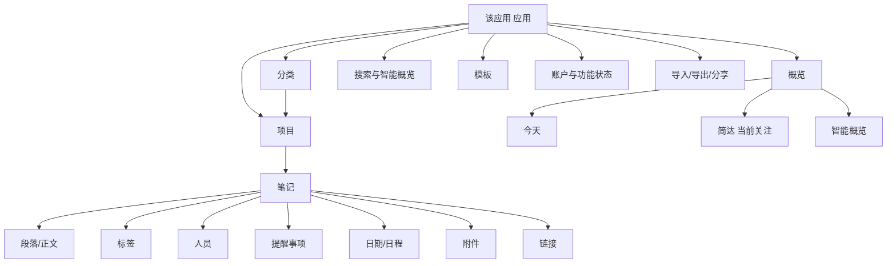
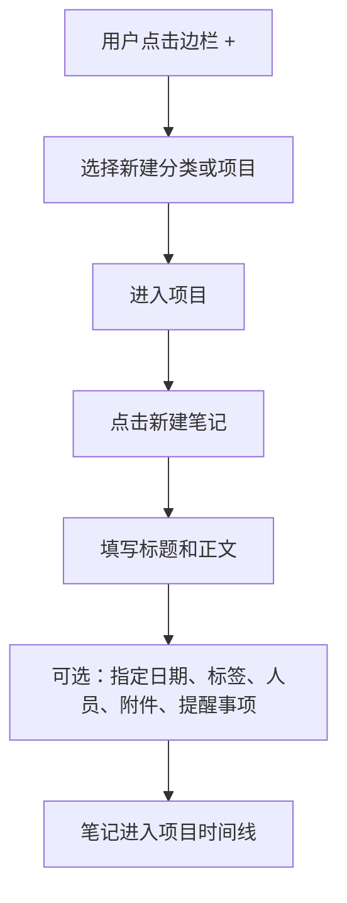
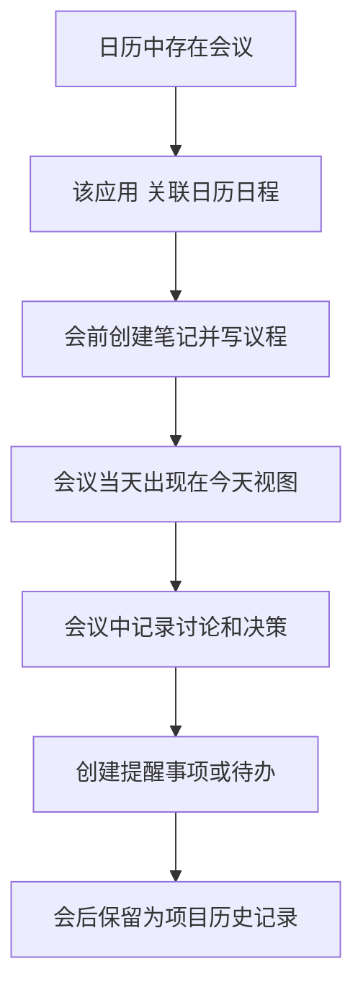
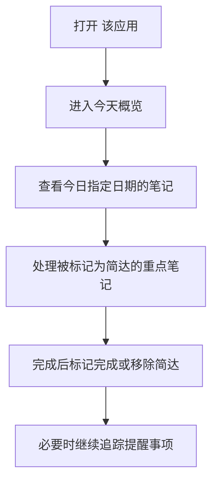
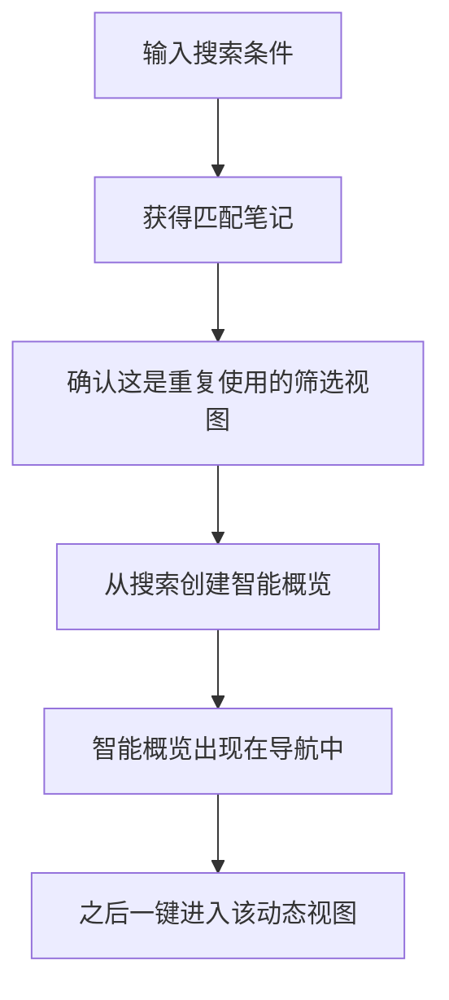
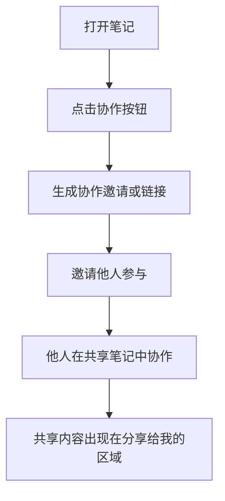

# 软件设计说明文档（脱敏版）

版本：1.0  
撰写日期：2026-05-26  
分析对象：macOS 版桌面应用  
本机安装版本：桌面应用版本信息已脱敏  
分析方法：实际打开应用观察主界面，读取应用包元数据、本地化菜单文案、AppleScript 定义、内置样例数据和动态链接框架信息。

## 1. 文档目的

本文档用于说明 该应用 这款软件的整体设计，包括产品定位、用户目标、信息架构、核心数据对象、主要功能模块、关键交互流程、界面布局、视觉与体验策略、系统集成方式、技术架构推断、隐私权限、风险点和优化建议。

需要特别说明的是，本文不是源码级架构文档，因为当前可访问材料主要来自已安装的 macOS 应用包和运行界面，而不是完整源代码仓库。因此，文档中的内容分为两类：

1. 明确事实：来自应用界面、Info.plist、菜单文案、资源文件、样例数据、AppleScript 定义和动态链接信息。
2. 合理推断：基于 macOS 应用包结构、框架依赖、界面模式和数据样例做出的设计推断。涉及推断的地方会明确标注。

## 2. 产品概览

该应用 是一款以“时间线”为中心的笔记与项目管理软件。它不是单纯的笔记 App，也不是传统意义上的任务管理器或日历工具，而是把项目、笔记、日期、日历日程、提醒事项、标签、人员和附件组合在同一个工作流中。

从内置样例文案可以看出，该应用 的核心理念是：

- 未来：用户可以提前为将来的会议、任务、项目节点创建笔记。
- 现在：到达某一天时，相关笔记进入今日视野，帮助用户集中处理当下事项。
- 过去：完成后的笔记保留为决策记录、会议纪要、过程档案和项目历史。

换句话说，该应用 试图解决的是“工作内容随着时间移动”的问题：一条笔记可以从计划变成行动，再变成记录。它的设计重点不是把任务清空，而是让用户持续拥有上下文。

## 3. 产品定位

### 3.1 核心定位

该应用 可以定位为：

- 面向项目的时间线笔记工具。
- 与日历和提醒事项深度结合的知识记录工具。
- 同时支持记录、计划、回顾和协作的个人/团队生产力工具。

### 3.2 目标用户

适合用户包括：

- 项目经理：需要按项目、会议、日期组织笔记。
- 知识工作者：需要长期记录决策、想法、资料和任务。
- 咨询、研究、产品、设计、开发人员：需要将会议、待办、资料和上下文放在一起。
- 个人时间管理用户：需要把日历、提醒事项和笔记整合。
- 团队协作用户：需要共享笔记、邀请他人协作、通过链接定位内容。

### 3.3 设计差异化

该应用 与常见产品的差异：

- 相比 Apple Notes：该应用 更强调项目、日期、时间线和日历关联。
- 相比 Things/Todoist：该应用 保留大量上下文，不把完成事项简单归档为“已完成任务”。
- 相比 Notion：该应用 更轻、更原生、更偏个人知识工作流，而不是数据库式工作空间。
- 相比日历：该应用 可以围绕日程保存长文本、附件、标签、人员和上下文链接。
- 相比纯 Markdown 编辑器：该应用 提供项目层级、智能概览、提醒事项、协作和系统级集成。

## 4. 核心设计理念

### 4.1 时间线优先

该应用 的核心不是文件夹，也不是纯标签，而是时间线。笔记可以被指定日期、关联日历日程、出现在“今天”或“简达”概览中。这样的设计让笔记不只是静态资料，而是会随着时间进入不同视图。

### 4.2 项目承载上下文

该应用 使用“分类 -> 项目 -> 笔记”的组织结构。分类用于大范围归组，项目用于承载具体工作流，笔记用于记录具体内容。这个层级比传统文件夹更贴近工作组织方式。

### 4.3 笔记是核心对象

从界面和菜单可见，绝大多数操作都围绕笔记展开：新建笔记、从模板新建、指定日期、关联日历日程、添加提醒事项、标记为“简达”、标记完成、移动、复制、导出、分享、协作、在单独窗口打开等。

### 4.4 原生系统能力优先

该应用 是一个 macOS 原生应用，集成了 Apple 的日历、提醒事项、联系人、Spotlight、服务菜单、分享扩展、Safari/Web Clipper、Widget、小组件、App Intents、AppleScript、Touch ID/Apple Watch 鉴权等系统能力。

### 4.5 渐进式复杂度

主界面保持克制：左侧项目，中间笔记，右侧相关面板可隐藏。高级能力通过菜单、上下文按钮、模板、检查器、相关面板和系统扩展逐步呈现。用户可以只把它当笔记 App 使用，也可以逐步启用时间线、标签、提醒、协作、自动化等能力。

## 5. 信息架构

### 5.1 顶层结构

该应用 的信息架构可以抽象为：



### 5.2 左侧项目边栏

主窗口左侧是“项目与分类列表”。它承担导航、层级组织和概览入口职责。

观察到的边栏设计要点：

- 支持显示/隐藏项目边栏。
- 支持后退/前进历史导航。
- 支持新建项目或分类。
- 内置概览包括“今天”和“简达”。
- 项目可以被锁定、归档、删除、在访达中显示。
- 分类可以新建、删除，也可以从选中内容创建子分类。

### 5.3 主内容区

主内容区显示当前项目、概览或筛选结果下的笔记集合。顶部标题区域显示当前位置路径，右侧有搜索和新建笔记按钮。

主内容区核心能力：

- 显示笔记列表或笔记集合。
- 支持按创建日期、编辑日期、指定日期、项目顺序排序。
- 支持按日期、内容、最近编辑、今天编辑等条件过滤。
- 支持展开/折叠笔记。
- 支持在笔记之间快速跳转。
- 支持在新窗口或单独窗口打开笔记。

### 5.4 右侧相关面板

界面中存在“相关面板”按钮，菜单文案也包含显示/隐藏相关面板。结合本地化文案，可推断右侧面板用于展示：

- 与当前笔记相关的其他笔记。
- 链接到当前笔记的反向链接。
- 同一日期、同一日历日程或重叠日期的笔记。
- 当前笔记中的标签、人员、提醒事项和附件。
- 日历与提醒事项相关信息。

这是 该应用 信息架构中的重要补充：它让笔记不孤立，而是通过日期、链接、人员和标签形成网络。

## 6. 核心对象模型

根据界面、菜单、样例数据和 AppleScript 定义，可以总结出以下核心对象。

### 6.1 应用 Application

应用级能力包括：

- 打开、打印、退出。
- 主窗口管理。
- AppleScript 查询当前选择项。
- 锁定 该应用。
- 添加/移除 该应用 锁。
- 账户登录、功能状态管理。
- 同步、导入、导出、分享、自动化。

### 6.2 分类 Category

分类是项目的容器。设计职责：

- 将多个项目归组。
- 提供更高层级的信息分类。
- 可新建、删除。
- 可通过选中内容创建子分类。

分类更像工作空间中的“领域”或“主题组”，例如工作、生活、客户、研究、课程等。

### 6.3 项目 Project

项目是 该应用 的主要组织单位。设计职责：

- 承载一组相关笔记。
- 属于某个分类或未分组区域。
- 可以排序、移动、归档、锁定、删除。
- 可以被链接、打开、搜索、导出。
- 可以作为笔记创建的目标位置。

项目是用户建立长期上下文的核心单位。

### 6.4 笔记 Note / Section

内置样例数据中使用 `sections` 表示笔记对象。每条笔记包含：

- `identifier`：笔记唯一标识。
- `title`：标题。
- `paragraphs`：正文段落列表。
- `startDate` / `endDate`：开始和结束日期。
- `timeZoneIdentifier`：时区。
- `eventIdentifier`：关联日历日程。
- `reminderIdentifier`：段落或提醒事项关联。
- `tags`：标签列表。
- `people`：人员列表。
- `attachments`：附件。
- `status`：状态。
- `priority`：排序优先级。
- `editedDate`：编辑时间。
- `isHidden`：是否隐藏。
- `isCollapsed`：是否折叠。
- `markedDeleted`：删除标记。
- `templateIdentifier`：模板来源。

这说明 该应用 的笔记不是简单文本文件，而是包含时间、状态、关系和格式的结构化对象。

### 6.5 段落 Paragraph

样例数据中每条笔记包含多个段落。段落对象包含：

- `content`：富文本内容，内部以 JSON 表示字符串和属性。
- `style`：段落样式，例如缩进层级。
- `tags`：段落级标签。
- `people`：段落级人员。
- `reminderIdentifier`：段落可关联提醒事项。
- `priority`：段落顺序。
- `markedDeleted`：段落删除标记。
- `isHidden`：是否隐藏。

这意味着 该应用 不只是“整篇笔记级别”的结构化，而是支持段落级语义。标签、人员、提醒事项可能可以作用于某段文本，而不仅是整个笔记。

### 6.6 标签 Tag

标签用于跨项目组织和检索内容。界面文案显示：

- 可以应用标签。
- 可以管理标签。
- 标签有颜色。
- 标签可以转换为纯文本。
- 可以按标签筛选当前项目或搜索全部项目。

标签是跨项目的横向索引。

### 6.7 人员 Person

人员对象用于把笔记与联系人或人名关联。界面文案显示：

- 可以指派人员。
- 可以在人员弹出层中筛选项目。
- 可以在所有项目中搜索人员。
- 应用请求联系人权限，用于将笔记中的人员与通讯录联系人关联。

人员设计适合会议纪要、客户管理、项目协作和责任分配。

### 6.8 日期与日历事件 Date / Calendar Event

该应用 的日期系统包括：

- 指定日期。
- 修改日期。
- 移除指定日期。
- 指定到今天。
- 显示日历日期。
- 关联日历日程。
- 取消关联日历日程。
- 创建新日历日程。
- 在日历中打开日程。
- 基于日期过滤笔记。

日期是 该应用 的核心索引维度之一。

### 6.9 提醒事项 Reminder

应用请求 Reminders 权限，菜单支持插入提醒事项。文案显示：

- 可以新建带提醒事项的笔记。
- 可以显示来自指定提醒事项列表的提醒。
- 可以识别提醒事项完成时间、到期时间和删除状态。
- 可以在文本编辑器中插入提醒事项。

提醒事项使 该应用 能兼顾任务管理，但它并没有把自己设计成纯待办 App。

### 6.10 附件 Attachment

附件能力包括：

- 添加附件和图片。
- 附件弹出菜单支持打开、打开方式、快速查看、拷贝、导出、分享、删除。
- 大量附件时会警告文件占用空间和跨设备传输速度。
- 导入 Apple Notes 时，文案提示只会导入图片附件。

附件设计兼顾记录完整性和同步性能风险。

### 6.11 智能概览 Smart Overview

智能概览是可保存的动态视图。菜单支持：

- 新建智能概览。
- 从搜索创建智能概览。
- 删除智能概览。
- 打开概览。

它相当于保存过的搜索/筛选器，使用户能构建自己的工作仪表盘。

### 6.12 模板 Template

模板能力包括：

- 从模板新建笔记。
- 新建并使用模板。
- 保存为模板。
- 模板管理入口。

模板适合会议纪要、周报、项目复盘、访谈记录、读书笔记等重复结构。

## 7. 主界面设计

### 7.1 布局结构

主窗口采用典型 macOS 生产力应用布局：


观察到的实际窗口结构：

- 窗口标题显示当前项目路径和当前笔记标题。
- 左侧为“项目与分类列表”。
- 顶部有当前位置标题、搜索按钮、新建笔记按钮。
- 内容区显示当前笔记标题、标记按钮、日期/日程按钮、协作按钮、正文编辑器、操作按钮。
- 有边栏显示/隐藏按钮和相关面板显示/隐藏按钮。

### 7.2 导航设计

导航采用三种方式并行：

- 层级导航：分类、项目、笔记。
- 时间导航：今天、日期筛选、前一天、后一天、回到今天。
- 历史导航：后退、前进、返回起点。

这能满足不同工作模式：

- 我知道项目在哪：走项目边栏。
- 我今天要处理什么：走今天视图。
- 我刚才看过哪里：走历史导航。
- 我只记得关键词：走搜索。

### 7.3 顶部工具栏

顶部工具栏非常克制，主要保留高频行为：

- 搜索。
- 新建笔记。
- 从模板新建笔记。
- 切换项目或概览。

低频功能通过菜单栏、上下文菜单、操作按钮和检查器承载。这符合 macOS 原生工具的使用习惯，也降低了主界面噪音。

### 7.4 笔记卡片/段落设计

笔记由标题区和正文区构成。标题区包含：

- 标题输入。
- “简达”标记按钮。
- 日期/日程关联按钮。
- 协作按钮。
- 操作菜单。
- 独立窗口打开按钮。

正文区是富文本编辑器，支持标尺、样式、列表、表格、附件、链接、标签、人员、提醒事项和 Markdown 相关能力。

## 8. 功能模块设计

### 8.1 项目与分类管理

功能点：

- 新建分类。
- 新建项目。
- 在分类中新建项目。
- 新建子分类。
- 删除分类。
- 删除项目。
- 归档项目。
- 锁定项目。
- 在访达中显示项目。
- 项目排序与移动。

设计说明：

项目和分类承担长期结构。该应用 在左侧边栏中提供快速新建入口，符合“先有项目，再持续沉淀笔记”的使用模型。

### 8.2 笔记管理

功能点：

- 新建笔记。
- 在所选笔记后新建笔记。
- 从模板新建笔记。
- 移动笔记。
- 复制笔记。
- 删除笔记。
- 标星。
- 标记为“简达”。
- 标记为已完成。
- 标记为已彻底完成。
- 折叠/展开笔记。
- 在新窗口打开。
- 在单独窗口打开。

设计说明：

该应用 把笔记同时看作“内容单元”和“工作单元”。因此它既有文本编辑能力，也有状态、日期、排序、完成、置顶、颜色标记等任务管理属性。

### 8.3 文本编辑器

支持能力：

- 粗体、斜体、下划线、删除线。
- 标题、副标题、小标题、副小标题、正文。
- 等宽文本、预制格式、代码块/代码样式。
- 支持多种代码语言标记，包括 Swift、Python、JavaScript、TypeScript、HTML、CSS、SQL、Shell、Rust、Go、Java、C、C++、C#、Ruby、PHP、Kotlin、Lua、Perl、YAML、TOML、JSON、XML、Diff、Makefile 等。
- 列表、编号列表、短划线列表、待办事项、核对清单。
- 表格、添加/删除行列、设置标题行、列对齐。
- 摘要、目录、块引用、水平分割线。
- 文本折叠。
- 缩进、行间距、字体大小、文本颜色、高亮。
- 查找、替换、拼写检查、语法检查、替换、数据检测器。
- 智能链接、短链接、应用内链接、网页链接。
- 当前日期、当前时间插入。
- Markdown 技巧、搜索语法小技巧、文本操作小贴士。

设计说明：

编辑器设计明显偏向“富文本 + Markdown 兼容 + 结构化语义”的混合模式。它不强迫用户用纯 Markdown，也不局限于简单富文本。对于知识工作者，这种设计兼顾自然书写和结构化整理。

### 8.4 日期、日程与时间线

功能点：

- 指定日期。
- 指定到今天。
- 修改日期。
- 移除指定日期。
- 显示日历日期。
- 前一天/后一天导航。
- 回到今天。
- 显示今天的日历。
- 关联日历日程。
- 取消关联日历日程。
- 新建日历日程。
- 在系统日历中打开日程。
- 按指定日期排序或筛选。

设计说明：

日期不是笔记的附属字段，而是主导航维度。该应用 的时间线设计使笔记拥有“发生时间”和“计划时间”，从而支持会议前准备、会议中记录、会议后追踪。

### 8.5 提醒事项

功能点：

- 插入提醒事项。
- 新建带提醒事项的笔记。
- 读取提醒事项列表。
- 显示提醒事项完成/到期状态。
- 处理提醒事项被系统 Reminders 删除的状态。

设计说明：

提醒事项解决“需要行动”的部分，但 该应用 没有把所有笔记都任务化。它保留了笔记的叙事和记录能力，只在需要时嵌入任务属性。

### 8.6 标签和人员

功能点：

- 为文本或笔记应用标签。
- 标签颜色。
- 管理标签。
- 按标签筛选当前项目。
- 按标签搜索全部项目。
- 指派人员。
- 按人员筛选项目或搜索全部项目。
- 使用联系人权限关联通讯录。

设计说明：

标签和人员属于横向组织机制，用于弥补项目层级的限制。项目是纵向上下文，标签和人员是跨项目索引。

### 8.7 链接与反向关系

功能点：

- 插入项目或笔记链接。
- 键入 `[[` 触发项目/笔记链接。
- 拷贝 应用内链接。
- 拷贝为 应用内链接。
- 前往已关联笔记。
- 识别反向链接。
- 通过 AppleScript 返回当前选中项目或笔记的标题和 URL。
- 支持 `app://` 和 `notes-scheme://` URL Scheme。

设计说明：

该应用 支持内部链接，具备类知识库的网络化能力。与日期、项目、人员、标签结合后，笔记之间可以形成多维关系图。

### 8.8 搜索与智能概览

功能点：

- 搜索。
- 在笔记内搜索。
- 快捷打开。
- 查找调色板。
- 查找和替换。
- 搜索语法小技巧。
- 从搜索创建智能概览。
- 过滤笔记：日期指向、最近编辑、今天编辑、带内容等。

设计说明：

智能概览是 该应用 的高级信息检索设计。普通搜索是一次性行为，智能概览是可复用视图。它能把某些工作流固定下来，例如“本周会议”“等待回复”“某客户相关”“带提醒事项的笔记”等。

### 8.9 模板系统

功能点：

- 从模板新建笔记。
- 保存为模板。
- 新建模板。
- 模板上下文菜单。

设计说明：

模板让重复工作标准化。对于会议、复盘、站会、课堂笔记、客户沟通记录等场景，模板能降低创建成本，并提高记录一致性。

### 8.10 附件与媒体

功能点：

- 添加附件和图片。
- 快速查看附件。
- 打开附件或选择打开方式。
- 导出附件。
- 分享附件。
- 删除附件。
- 大量附件警告。

设计说明：

附件增强了笔记作为资料容器的能力，但 该应用 同时通过警告提醒同步性能和存储成本，说明产品在设计上意识到“笔记数据库膨胀”的风险。

### 8.11 分享、协作和社区

功能点：

- 分享。
- 与他人协作。
- 协作链接。
- 该应用 社区窗口。
- 分享给我的。
- 系统分享扩展。
- Web Clipper。
- 通过服务菜单把选中内容发送到 该应用。

设计说明：

该应用 既支持个人知识管理，也扩展到协作场景。协作入口放在笔记标题区，说明协作粒度主要是“笔记”而非整个工作空间。

### 8.12 导入、导出与打印

导入支持：

- Apple Notes。
- Evernote ENEX。
- Simplenote。
- Markdown。
- 纯文本。
- TextBundle。
- 文件夹。

导出支持：

- 应用归档文件。
- Markdown。
- HTML。
- PDF。
- RTF。
- 带附件的 RTF。
- Word 文稿。
- 纯文本。
- 单文件导出。
- 每条笔记一个文件。
- 每个项目一个文件。
- 选中笔记、所选项目、所选分类导出。

打印支持：

- 打印。
- 打印所选笔记。
- 页面设置。
- 打印彩色笔记背景。
- 打印水印控制。

设计说明：

该应用 的导入导出设计比较完整，说明它定位为长期资料库时，重视迁移、备份和分享。TextBundle、Markdown 和 Word/PDF 支持也让它能融入不同工作流。

### 8.13 隐私与锁定

功能点：

- 锁定 该应用。
- 给 该应用 添加锁。
- 给项目添加锁。
- 锁定所有私有笔记和项目。
- 使用 Touch ID 或 Apple Watch 认证。
- 隐私鉴权界面。

设计说明：

锁定功能说明 该应用 预期用户会记录私人或敏感内容。锁定粒度包括应用级和项目级，兼顾整体保护和局部保护。

### 8.14 账户、功能状态与同步

功能点：

- 该应用 账户。
- 功能状态检查。
- 账户用于跨设备保持一致的功能可用状态。
- iCloud Drive 同步提示。
- iOS 和 iPadOS 版功能联动。
- 版本兼容性检查。
- 不同设备版本不兼容时提示更新。

设计说明：

同步依赖 iCloud Drive，同时账户用于跨设备状态恢复、协作身份识别和安全校验。协作服务和账户服务分别指向 `协作服务域名已脱敏` 与 `账户服务域名已脱敏`。

### 8.15 进阶能力与深度工作流

这一部分是对进阶能力的集中补充。该应用 的进阶能力不是单一功能集合，而是围绕“把笔记变成可执行、可检索、可自动化、可跨设备流动的工作对象”展开。根据功能文案、菜单、本地化资源、扩展包和 App Intents 信息，可以将进阶能力分为以下几组。

#### 8.15.1 功能体系

该应用 的功能体系有两个重要特点：

1. 功能不是孤立陈列，而是围绕输入、整理、检索、协作、导出和自动化形成工作流。
2. 功能窗口会按最新上线、历史功能、已添加、附属能力等状态组织，让用户理解能力边界和使用入口。

这种设计更像“功能地图”：它不只告诉用户有哪些能力，还会把能力放回真实任务中，解释为什么某个功能会在当前场景出现。

功能体系相关设计要点：

- 通过 该应用 账户在设备之间恢复功能状态。
- 支持跨设备功能连续性。
- 支持从功能窗口进入对应工作流。
- 支持通过分享和邀请入口传播使用场景。
- 功能概览区按“最新上线”“往期发布”“已添加”“附赠”等状态展示能力。
- 功能入口在用户触发相关能力时以说明弹窗出现，而不是只放在设置页中。

这种设计的好处是：功能发现与具体使用场景绑定，用户在“正好需要这个能力”的时刻理解价值。

#### 8.15.2 智能问答 智能搜索助手

资源文件显示 该应用 23.0 中包含 `智能问答` 功能。它不是简单搜索框，而是一个围绕本地笔记的智能问答入口。

功能线索包括：

- 用户可以输入自然语言问题。
- 智能问答 会搜索笔记来回答问题。
- 可以提供通往重要笔记的链接。
- 可以处理日期范围，例如“上周”。
- 可以总结找到的笔记。
- 可以基于找到的内容进行推理。
- 支持后续问题，即围绕同一组笔记继续对话。
- 文案强调“永远不会将数据上传到云端”。
- 如果 Apple Intelligence 不可用，会提示用户在系统设置中启用。

设计推断：

智能问答 更像“本地语义检索 + 系统智能能力”的组合，而不是服务器端聊天机器人。它的产品价值在于把长期积累的项目笔记变成可询问的知识库，同时用“本地处理、不上传云端”降低用户对隐私的顾虑。

在交互上，它应该承担三种任务：

- 查找：帮用户找到相关笔记。
- 总结：把多条笔记的内容压缩成答案。
- 跳转：答案不是终点，而是引导用户回到原始笔记继续工作。

这与 该应用 的设计哲学一致：AI 不是替代笔记，而是帮助用户重新进入上下文。

#### 8.15.3 智能概览与高级搜索

智能概览是 该应用 的核心进阶能力之一。普通搜索是一次性的，智能概览把搜索条件保存到边栏，并自动刷新结果。

支持的筛选维度包括：

- 文本搜索。
- 日期范围。
- 今日、即将到来、简达。
- 标签。
- 人员。
- 颜色。
- 星标段落。
- 已勾选/未勾选清单项。
- 完成/未完成提醒事项。
- 项目或分类范围。
- 附件文本搜索，尤其是 PDF 等可提取文字附件。

设计价值：

- 把“找东西”变成“持续监控一个动态集合”。
- 让用户为不同工作模式保存独立入口，例如“本周会议”“等待回复”“某客户相关”“未完成提醒”“含 PDF 合同的笔记”。
- 让标签、人员、颜色、提醒事项不只是视觉标记，而成为可计算的过滤条件。

这使 该应用 的边栏不仅是文件夹树，也是一组可保存的工作视图。

#### 8.15.4 模板系统

该应用 的模板系统支持把现有笔记保存为模板，并从模板创建新笔记。资源文件显示模板支持占位符，且占位符会在新建笔记时替换为动态内容。

可见占位符包括：

- 剪贴板内容。
- 当前日期。
- 当前时间。
- 关联日程日期。
- 关联日程标题。
- 关联日程备注。
- 分享扩展或 x-callback-URL 提供的内容。

典型高级场景：

- 会议纪要模板自动填入日程标题和日期。
- 日报模板自动填入当前日期。
- 客户回访模板保留固定字段。
- 从分享扩展保存网页时，将网页内容注入模板指定区域。
- 用 x-callback-URL 从外部自动创建结构化笔记。

设计重点：

模板并不只是“复制一份固定文本”，而是将外部上下文、系统日期和用户选择注入笔记。这让 该应用 可以成为半自动化的记录系统。

#### 8.15.5 高级编辑器能力

菜单和功能文案显示，该应用 的编辑器包含大量高级编辑能力：

- 高级表格。
- 自动调整表格列宽。
- 拖放表格行和列。
- 表格列居左、居中、居右。
- 标题行。
- 段落和列表项拖动排序。
- 折叠笔记中的部分内容。
- 内容过滤。
- 清单项批量操作，例如全部勾选、置底已勾选项、拷贝/剪切未勾选项、把未勾选项移动到新笔记。
- 代码和预制格式支持多种语言，包括 Swift、Python、JavaScript、TypeScript、HTML、CSS、JSON、YAML、SQL、Shell、Bash、Rust、Go、C/C++、Java、Ruby、PHP、Kotlin、Lua、TOML、Diff 等。
- 智能链接。
- 数据检测器。
- 智能拷贝/粘贴。
- 拷贝为纯文本、Markdown、HTML。

这些设计说明 该应用 并不把笔记正文看作普通富文本，而是看作由段落、块、表格、清单、代码块、链接和附件组成的结构化内容。

#### 8.15.6 私密内容与锁定

该应用 的隐私功能可以隐藏私人笔记和项目，也可以锁定整个应用。

功能点：

- 锁定笔记。
- 锁定项目。
- 锁定所有私有笔记和项目。
- 锁定 该应用 应用。
- 设置独立于 该应用 账户的隐私密码。
- 支持 Touch ID。
- 支持 Face ID。
- macOS 支持 Apple Watch 鉴权。
- 私密内容在认证前隐藏。

需要注意的重要边界：

- 文案明确说明“私人笔记和项目被隐藏起来，但不会被加密”。

设计含义：

该功能主要解决“旁人临时看到屏幕或共用设备”的隐私问题，而不是对本地数据库进行端到端加密。文档、产品说明和设置界面都需要清楚表达这一点，避免用户误以为这是安全加密保险箱。

#### 8.15.7 协作与共享笔记

该应用 支持与他人协作编辑笔记。资源文件显示，协作模块包括邀请、共享链接、参与者、聊天、重新加入、合并、离开共享、终止共享等完整流程。

关键能力：

- 邀请其他用户查看和编辑笔记。
- 通过邮件邀请。
- 通过链接邀请。
- 接受邀请者只需要能打开协作链接。
- 发起协作需要登录账户并完成协作状态检查。
- 参与者可以设置昵称。
- 支持“与您共享”列表。
- 支持共享笔记聊天。
- 支持重新加入协作并与本地副本合并。
- 停止共享后，自己保留最后修订版。
- 离开共享后，其他人可以继续协作。
- 终止共享后，阻止其他人未来加入。
- 上传前加密，云端保持加密状态。

设计重点：

协作对象是“笔记”，不是整个工作区或整个项目。这使协作粒度非常细，适合会议纪要、单个计划、共享清单、临时讨论等轻量协作场景。

#### 8.15.8 发送到应用 与收件箱

功能文案显示 该应用 支持 `发送到应用`：用户可以在 Mac 应用中获取一个专属邮件地址，然后从任何地方发送邮件，邮件会作为笔记出现在同步的收件箱中。

设计价值：

- 用户不需要安装扩展或打开应用，也能捕捉信息。
- 从公司邮箱、移动设备、第三方服务转发内容进入 该应用。
- 将 该应用 变成个人知识和任务的统一收件箱。

这类功能的关键设计点是信任与去重：

- 用户需要清楚知道邮件会进入哪个项目或收件箱。
- 需要处理附件、HTML 邮件、转发头、签名等噪声。
- 需要避免私人邮箱地址泄露后被垃圾内容污染。

#### 8.15.9 分享扩展与 Web Clipper

该应用 包含 macOS 分享扩展和 Web Clipper。

分享扩展支持的输入类型非常广，包括：

- PDF。
- URL。
- 通用内容。
- 图片。
- 邮件。
- vCard。
- 压缩包。
- 文本。
- RTF / RTFD。
- Web Archive。
- 演示文稿。
- 数据库文件。
- 待办事项。
- 日历事件。
- Internet Location。
- 音视频内容。

Web Clipper 的 Safari 扩展描述是“将网页和选中内容保存到 该应用 收件箱”。其 manifest 使用 Manifest V3，权限包含：

- `activeTab`
- `scripting`
- `nativeMessaging`
- `notifications`
- `<all_urls>` 主机权限

Web Clipper 相关文案显示：

- 可以保存网页和选中内容。
- 保存到 该应用 收件箱。
- 页面过长时会把文本作为附件保存。
- 图片太多时可能无法保存。
- 保存成功后发送通知。
- 需要打开 该应用 才能使用或完成连接确认。

设计含义：

该应用 将“输入来源”做得很宽：用户可以从浏览器、Finder、邮件、日历、提醒事项、其他 App 的分享菜单把内容送进 该应用。这是高级知识工作流的关键，因为真正的工作资料并不只产生在 该应用 内部。

#### 8.15.10 快捷指令、Siri、App Intents 与 AppleScript

该应用 的自动化能力分为多层。

快捷指令 / App Intents 能力：

- 新建分类。
- 新建项目。
- 新建笔记。
- 向笔记追加文本。
- 获取笔记纯文本。
- 获取笔记 Markdown。
- 获取笔记摘要。
- 获取选中的笔记。
- 获取选中的项目。
- 获取选中文本。
- 打开笔记。
- 打开项目。
- 打开概览。
- 打开“简达”和“今天”概览。
- 分类过滤 Focus Filter：在某个系统专注模式下只显示指定分类。

Widget / Intent 能力：

- 收藏笔记小组件。
- 相关笔记小组件。
- 可配置显示全部、简达、今天、即将到来的笔记。
- 可选择某条收藏笔记。
- 内部 App Intent 支持切换某条笔记是否在“简达”上。

AppleScript 能力：

- `selection` 命令可以返回当前选中笔记或项目的标题和 URL。
- 返回的 URL 可重新打开 该应用 到该项目或笔记。

URL Scheme 能力：

- `应用归档`
- `notes-scheme`
- `db-3vz3176zb7bd5l6`

设计价值：

该应用 同时照顾了普通用户、自动化用户和系统级集成：

- 普通用户用 Siri 和快捷指令。
- 高级用户用 URL Scheme、x-callback-URL、AppleScript。
- 桌面环境用 Widget、分享扩展、Web Clipper。
- 专注模式用户用 Focus Filter 切换可见分类。

#### 8.15.11 小组件与 Apple Watch

小组件资源显示 该应用 提供至少两类小组件：

- 收藏的笔记。
- 相关笔记，包括简达、今天、临近笔记、即将到来笔记。

功能文案还显示 Apple Watch 支持：

- 查看最重要的笔记。
- 查看相关笔记。
- 选择收藏。
- 勾选清单。
- 口述新段落。
- 与 iPhone 应用同步。

设计含义：

该应用 的跨设备设计并不是简单“在不同屏幕上打开同一份笔记”，而是针对设备场景做了重新组织：

- Mac：深度编辑、项目管理、导入导出、自动化。
- iPhone：移动查看、快速捕捉。
- Apple Watch：查看当下最重要的内容、勾选清单、口述新增。
- Widget：无需进入应用即可查看当前相关内容。

#### 8.15.12 高级外观与可访问性

进阶能力包含笔记外观和可读性调整：

- 更换字体。
- 标签显示风格。
- 列表符号样式。
- 自定义行间距。
- 多种文本高亮颜色。
- 更多文字颜色。
- 更多分类颜色。
- 全宽图片。

应用包中还包含 OpenDyslexic 与 Atkinson Hyperlegible 字体，说明它在可读性和阅读障碍友好方面做了专门设计。

设计价值：

对于长期笔记工具，外观不是纯装饰。字体、行距、颜色、标签样式会直接影响长时间阅读、会议记录、复盘和查找效率。

#### 8.15.13 项目规模管理

进阶能力还包括一组用于大型资料库维护的能力：

- 子分类。
- 项目归档。
- 最近项目筛选。
- 置顶与置底笔记。
- 多窗口。
- 快捷打开。
- 附件搜索。

这些能力说明 该应用 预期用户会积累大量项目和笔记。早期用户只需要分类和项目；重度用户则需要归档、筛选、快捷打开、置顶、智能概览和附件搜索来维持系统可用性。

#### 8.15.14 进阶能力设计总结

该应用 的进阶能力可以概括为五条产品主线：

1. 更快捕捉：分享扩展、Web Clipper、发送到应用、快捷指令、Apple Watch 口述。
2. 更强组织：智能概览、子分类、归档、最近项目、置顶置底、模板。
3. 更深编辑：高级表格、结构化段落、折叠过滤、代码块、Markdown/HTML 输出。
4. 更广集成：日历、提醒事项、联系人、小组件、Siri、App Intents、AppleScript、URL Scheme。
5. 更安全协作：私密隐藏、应用锁、协作笔记、云端加密协作内容。

这说明 该应用 的进阶能力不是零散堆叠，而是在服务一个完整闭环：信息进入 该应用，被组织到项目和时间线中，被结构化编辑，被搜索和智能概览重新浮现，再通过协作、导出、自动化和跨设备能力流向下一步行动。

### 8.16 彻底补漏：深层资源审计新增发现

在进一步检查应用包、中文本地化资源、扩展声明、隐私清单、样例数据和主窗口辅助功能树后，可以补充一批之前容易被忽略的设计点。这些点很多不一定在首屏显眼出现，但它们构成了 该应用 作为成熟生产力工具的“后台骨架”。

#### 8.16.1 偏好设置不是配置页，而是工作流控制中心

偏好设置资源显示，该应用 至少包含以下设置组：

- 通用：新项目是否自动创建空白笔记、新笔记是否默认指定到今天、新笔记是否默认标记为“简达”、相对日期、周数、每周第一天。
- 外观：浅色、深色、跟随系统、强调色、字体、字体大小、行间距、笔记预览。
- 编辑样式：无序列表默认使用短划线或项目符号，已勾选项目可保持默认、变灰或加删除线。
- Token 样式：标签、人员、附件可以使用默认醒目样式，也可以使用更轻的样式，适合高密度标签用户。
- 日历：选择显示哪些日历，是否导入日程备注。
- 提醒事项：选择显示哪些列表，是否默认创建全天提醒事项。
- 同步：禁用、iCloud、iCloud 端到端加密、Dropbox。
- 账户：该应用 账户登录、Apple 登录、重置密码、删除账户、恢复功能状态、更新账户状态。
- 隐私：更改私密内容密码，不使用时锁定 该应用。
- 支持：访问社区、隐私政策、关于 该应用。

设计含义：

该应用 把“输入默认值”和“显示策略”放进偏好，而不是让用户每次创建笔记时重复选择。这是面向长期使用的设计：用户一旦形成固定方法，例如每天新笔记都进“今天”、所有新笔记都上“简达”、核对清单完成后自动弱化，系统就能减少摩擦。

#### 8.16.2 同步策略体现强烈的信任边界设计

同步文案显示 该应用 支持四种状态：

- 禁用同步。
- iCloud。
- iCloud 端到端加密，依赖用户启用 Apple 高级数据保护。
- Dropbox。

值得注意的是，同步说明强调笔记和附件存储在用户个人 iCloud 或 Dropbox 账户中。这种设计把数据所有权叙事放在用户侧，而不是放在 该应用 自有服务器侧。

产品价值：

- 对普通用户：降低跨设备使用门槛。
- 对隐私敏感用户：明确知道数据不被强制放入应用厂商账户。
- 对企业/专业用户：Dropbox 和 iCloud 的双通道能适配不同组织习惯。
- 对高级用户：端到端加密文案增强信任，但也依赖系统级能力，不由 该应用 单独承诺。

#### 8.16.3 相关面板是第二主界面

相关面板资源非常丰富，说明它并不是附属抽屉，而是 该应用 的第二主界面。它覆盖：

- 时间轴：今天、昨天、明天、周数、近期编辑、即将开始、即将到期、过期。
- 日期操作：指定日期、日期范围、移除日期、跳转日期、重新安排。
- 日历事件：新建、编辑、删除、显示到日历 App、链接到笔记、取消链接、全天/定时切换、时区切换。
- 提醒事项：新建、编辑、完成、重新安排、加入笔记、显示到提醒事项 App、全天/定时切换。
- 快捷操作：5 分钟后、15 分钟后、30 分钟后、1 小时后、2 小时后、明天、下周、下个月。
- 关联笔记：已指定笔记、已关联笔记、相关笔记、最近编辑。
- 权限引导：连接日历、连接提醒事项、打开系统账户设置、了解更多。
- 异常处理：日历不可修改、列表不可修改、日历不存在、提醒事项不存在、日历 App 未准备好、提醒事项列表未载入、保存失败。

设计含义：

该应用 把“时间管理”放在侧边，而不是塞进正文编辑器。这让正文保持笔记属性，相关面板承担任务调度、日程关联和系统对象同步。这个边界很关键：正文是内容，右侧是上下文和行动。

#### 8.16.4 搜索和筛选系统比普通全文搜索复杂得多

文档标题区和搜索资源显示，该应用 支持多层过滤：

- 搜索所有项目或限制到当前分类/项目。
- 搜索日期、标签、人员。
- 搜索今天、较早、现在、处理中、临近、历史、最近编辑。
- 过滤“简达”笔记、完成笔记、未完成笔记、带内容笔记、彩色笔记、含未勾选待办事项笔记。
- 按日期升降序、标题 A-Z/Z-A、分组排序。
- 段落级筛选：标题、第一段、正文、标题样式、引用、代码/预设格式、水平分割线。
- 列表项筛选：项目符号、短划线、编号、已勾选、未勾选。
- 内容类型筛选：附件、链接、表格、标签、人员、星标、高亮、提醒事项、完成提醒、搜索条件。
- 可排除所选内容或仅包含所选内容。
- 可将搜索或今天视图保存为智能概览。

设计含义：

该应用 的搜索不是“找一个字符串”，而是“把资料库临时重组为一个工作视图”。智能概览本质上是保存后的查询视图，因此搜索、筛选和概览构成同一个能力链。

#### 8.16.5 右键菜单揭示了编辑器的专业深度

上下文菜单资源显示，该应用 的编辑器支持：

- 文本样式：标题、小标题、副标题、副小标题、正文、块引用、预制格式、等宽。
- 字符样式：粗体、斜体、下划线、删除线、上标、下标、文本颜色、高亮。
- 列表：项目符号、短划线、编号、核对清单、勾选。
- 插入：当前日期、当前时间、水平分割线、附件、链接、人员、标签、提醒事项、表格。
- 表格操作：上方/下方添加行，前方/后方添加列，删除行列，列左/中/右对齐，标题行切换。
- 代码块语言：Swift、Objective-C、C、C++、C#、Java、JavaScript、TypeScript、Python、Ruby、Go、Rust、Kotlin、PHP、Lua、R、SQL、Bash、Shell、Makefile、Diff、JSON、XML、YAML、TOML、CSS、SCSS、Less、Visual Basic .NET 等。
- 笔记结构操作：拆分笔记、复制笔记、移动、置顶、置底、折叠/展开、存储为模板。
- 复制/分享格式：纯文本、Markdown、HTML、应用内链接。

设计含义：

该应用 的编辑器介于普通富文本和开发者友好 Markdown 编辑器之间。它既照顾会议纪要、清单、附件和表格，也照顾代码块、Markdown 输出和结构化文本操作。

#### 8.16.6 附件系统有显示模式、搜索和大文件风险提示

附件相关资源补充说明了几个细节：

- 附件可以以缩略图、缩略图与标题、内嵌、全宽幅等形式显示。
- 附件可命名。
- 附件可以删除。
- 大文件加入时会提示同步变慢、占用空间更多。
- 拖放文件时按住 Control 可改为文件链接，避免真正嵌入大文件。
- Web Clipper 若网页内容太长，会将文本作为附件放入笔记。
- Web Clipper 若图片太多，会提示无法保存或无法下载部分图片。

设计含义：

该应用 把附件当作笔记的一等内容，但同时用提示控制同步成本。全宽图适合视觉资料，缩略图适合资料索引，文件链接适合大文件引用。

#### 8.16.7 人员和标签都有独立管理器

标签和人员浏览器资源显示：

- 可以搜索或创建标签/人员。
- 可以编辑名称。
- 可以删除，并影响所有出现位置。
- 可以合并。
- 可以转换为纯文本。
- 可以在当前项目或所有项目中搜索。
- 可以为某个标签或人员创建智能概览。
- 标签可以改颜色。
- 人员可以链接到通讯录联系人，也可以取消链接。
- 人员弹出菜单支持发送邮件、发送消息、FaceTime、WhatsApp、打开联系人。

设计含义：

该应用 的 `#标签` 和 `@人员` 不是普通文本符号，而是数据库对象。它们承担横向索引、联系人集成、沟通入口和智能概览入口。

#### 8.16.8 模板系统支持动态占位符

模板资源显示，模板不只是“复制一条旧笔记”，而包含占位符机制：

- 当前日期。
- 当前时间。
- 剪贴板内容。
- 日程标题。
- 日程日期。
- 日程备注。
- 分享扩展或 x-callback-URL 传入内容。

部分占位符支持参数，例如日期格式、时间格式、日程开始/结束信息等。

设计含义：

模板服务的是重复工作流：会议纪要、日程复盘、客户记录、日报周报、网页剪藏整理等。占位符让模板在创建瞬间自动吸收上下文，减少手动复制。

#### 8.16.9 系统入口非常多，该应用 不只靠主窗口获客和捕捉

进一步检查显示，该应用 的输入入口包括：

- 主窗口新建笔记。
- 系统服务菜单“发送到 该应用”。
- 分享扩展。
- Safari Web Clipper。
- URL Scheme / x-callback-url。
- 快捷指令 / App Intents。
- AppleScript。
- Apple Watch 口述。
- 小组件跳转。

这些入口分别服务不同场景：

- 当前正在阅读网页：Web Clipper。
- 当前正在其他 App 选择文本或文件：分享扩展或服务菜单。
- 当前正在自动化流程：快捷指令、App Intents、AppleScript、URL Scheme。
- 当前离开 Mac：Apple Watch。
- 当前只想查看：Widget。

#### 8.16.10 分享扩展输入范围很宽，但也有明确排除

分享扩展声明支持 PDF、URL、通用内容、图片、邮件、vCard、压缩包、纯文本、RTF、RTFD、Web Archive、演示文稿、数据库、待办事项、日历事件、internet location、音视频内容等。

同时它排除了 该应用 自有归档和 Markdown 文本。这可能是为了避免循环导入、重复处理或与系统文档打开逻辑冲突。

设计含义：

该应用 希望成为“收件箱式捕捉工具”，但不是无差别吞入所有类型。它对可处理内容放宽入口，对更适合文档导入或本体打开的类型保留边界。

#### 8.16.11 Web Clipper 的失败状态设计很完整

Web Clipper 本地化资源显示它至少处理这些状态：

- 该应用 未打开，提示先打开 该应用。
- 连接失败，提示重启 该应用。
- 页面没有可保存内容。
- 无法读取页面。
- 无法保存到 该应用。
- 缺少 token，提示打开 该应用 后重试。
- 图片太多，无法保存。
- 保存中。
- 已保存到收件箱。
- 保存后可点击通知打开。

设计含义：

Web Clipper 是跨进程、跨浏览器页面、跨原生 App 的复杂链路。失败状态完整说明产品意识到这个入口可能受权限、页面结构、图片数量、该应用 进程状态影响。

#### 8.16.12 协作系统包含身份、邀请、聊天、合并和退出

协作资源进一步显示：

- 首次分享需要 该应用 账户。
- 被邀请者也可能需要登录或注册。
- 可通过邮件或链接邀请。
- 可设置接受邀请的人能否编辑。
- 有参与者列表和昵称选择。
- 支持共享笔记并聊天。
- 支持“与您共享”列表。
- 离开共享时保留本地副本。
- 终止共享后阻止他人未来加入。
- 重新加入曾经参与过的共享时会提示合并风险。
- 分享成功但邀请失败时有独立错误提示。
- 内容上传前加密，云端保持加密。

设计含义：

该应用 的协作不是简单“发一份副本”，而是一个包含身份、权限、邀请渠道、消息协同、本地副本和冲突合并的系统。这里的复杂度已经接近协作文档产品。

#### 8.16.13 私密功能强调“隐藏”，不把自己包装成加密保险箱

隐私资源非常明确：

- 私密笔记和项目内容会隐藏，直到认证。
- 可用 Touch ID、Face ID、Apple Watch 或独立密码认证。
- 可以锁定整个 该应用。
- 私密密码可以不同于 该应用 账户密码。
- 文案明确说明：私密笔记和项目被隐藏，但不会被加密。

设计含义：

这是很重要的产品诚实性。该应用 的私密功能主要防旁观和临时借用设备，不等同于端到端加密笔记库。同步加密与本地隐藏是两条不同安全线。

#### 8.16.14 账户与功能状态说明降低长期使用焦虑

账户和功能状态文案补充说明：

- 账户可用于跨设备保持功能状态。
- 可恢复功能状态和账户关联信息。
- 可查看当前可用能力。
- 可查看新发布功能。
- 可查看功能窗口底部的当前状态。
- 删除 该应用 账户会删除账户资料、社区资料和通讯偏好。

设计含义：

长期笔记工具需要让用户确信资料、账户和功能状态不会变成不可理解的黑箱。该应用 用账户状态、功能列表和跨设备说明降低不确定性，让用户知道当前环境下可以使用哪些能力。

#### 8.16.15 小组件和 App Intents 将 该应用 暴露给系统层

小组件资源显示两类核心组件：

- 收藏笔记。
- 相关笔记，包括“简达”、今天、临近、全部等过滤。

App Intents / 快捷指令资源显示：

- 新建分类。
- 新建项目。
- 新建笔记，可附带项目、日期、日程标题、“简达”状态。
- 向指定笔记追加文本。
- 获取当前选中的笔记、项目、文本。
- 获取笔记纯文本、Markdown 和摘要。
- 打开笔记、项目、概览。
- 打开搜索。
- 搜索笔记，并支持标签、人员和全文。
- 修改笔记是否在“简达”。
- 焦点模式分类过滤。

设计含义：

该应用 并不是一个封闭应用，而是在系统自动化层提供对象模型。分类、项目、笔记、概览都能被系统识别和调度。

#### 8.16.16 社区、反馈、迁移和更新是产品生命周期设计的一部分

资源里有独立的社区、反馈、迁移和更新模块：

- 社区入口支持登录、注册、打开浏览器、刷新、分享当前页面。
- 反馈邮件模板包含操作步骤、错误、诊断信息、错误日志。
- 迁移错误有专门邮件模板。
- 更新提示会拦截未迁移资料库。
- 如果旧设备或旧系统不兼容，会提示继续同步可能导致意外结果甚至数据损坏。
- macOS / iOS / iPadOS 版本过旧时，会提示升级系统后再同步。

设计含义：

该应用 作为跨设备长期资料库应用，必须管理“版本漂移”风险。迁移和更新文案说明它不只关心功能上线，也关心旧数据、旧系统和多设备同步的安全。

#### 8.16.17 空状态和错误状态非常多，说明产品预期复杂资料库会经常进入边界场景

资源中可见大量空状态：

- 收件箱为空。
- “简达”为空。
- 今天没有笔记。
- 当前项目没有笔记。
- 智能概览没有匹配。
- 废纸篓为空。
- 所有项目没有搜索匹配。
- 当前过滤条件没有结果。
- 没有标签。
- 没有人。
- 没有模板。
- 没有日历日程或提醒事项。
- 没有近期编辑。
- 没有与您共享的笔记。

错误状态包括：

- 拷贝失败。
- 未设置邮箱，无法给支持人员发送项目文件。
- 日历/提醒事项权限未开启。
- 日历或列表不可修改。
- 日历、提醒事项或联系人已不存在。
- 网络错误。
- 登录验证失败。
- 账户凭据验证失败。
- 未知错误，建议联系支持。

设计含义：

这类文案体现了成熟应用常见但很少被首屏展示的设计工作：当用户资料库变大、同步变复杂、权限变化、外部对象被删除时，系统要用可理解的语言把用户带回可操作路径。

#### 8.16.18 样例项目本身是一套交互式教程

主窗口样例数据和 `sample.archive` 资源显示，该应用 默认样例不是随便放几条笔记，而是刻意覆盖产品关键能力：

- 欢迎项目引导用户创建分类、项目和笔记。
- 示例会议笔记包含出席者、缺席者、摘要、行动项。
- 行动项包含核对清单、人员、标签、截止日期。
- 笔记包含外部链接和图片/附件。
- 示例文字引导用户搜索、使用 Markdown、连接日历、安装其他设备、加入社区和反馈。

设计含义：

该应用 用样例资料库替代静态新手教程。用户不是先看一堆说明，而是在真实笔记环境里探索产品模型。

#### 8.16.19 隐私清单显示使用分析 SDK，但声明不追踪

应用和扩展资源中包含 TelemetryDeck 相关隐私清单。清单显示：

- 访问 UserDefaults，原因码为 `CA92.1`。
- 收集产品交互数据，用于分析。
- 收集设备 ID，用于分析。
- 数据不与用户身份链接。
- 不用于追踪。
- `NSPrivacyTracking` 为 false。

设计含义：

该应用 有产品分析能力，用于理解功能使用或稳定性，但隐私清单声明其分析数据不链接用户身份、不用于跨 App 追踪。对于笔记应用来说，这是信任设计的一部分，应在产品说明里单独记录。

#### 8.16.20 菜单栏和服务菜单说明 macOS 原生程度很高

主窗口辅助功能树显示标准 macOS 菜单：该应用、文件、编辑、笔记、插入、格式、显示、分享、窗口、帮助。服务菜单还提供“发送到 该应用”，用于把其他 App 中选择的内容直接生成 该应用 笔记。

设计含义：

该应用 不是把移动端 UI 简单搬到 Mac，而是深度接入 macOS 的菜单栏、服务、分享、快捷指令、窗口、多窗口和系统权限模型。这让它更像传统 Mac 生产力软件，而不是单窗口笔记网页壳。

### 8.17 真实界面走查补充：功能窗口与高级菜单

在实际打开 该应用 的功能状态界面、偏好设置、功能列表和菜单栏后，可以进一步确认几个仅靠静态资源容易遗漏的设计点。

#### 8.17.1 功能窗口用于集中展示当前可用能力

偏好设置和功能窗口中显示的状态文案为：

- 当前环境下可用的功能状态。
- 新发布功能和历史功能分组展示。
- 当前高亮功能之一是“可拖动的段落和列表项”。
- 功能窗口底部显示当前状态。

这说明 该应用 把功能可用性做成一个可查看、可解释的状态面板，而不是把能力分散在菜单深处。对长期笔记软件来说，这很重要：用户需要知道自己当前可以依赖哪些功能，尤其是跨设备、导出、协作和系统集成类能力。

#### 8.17.2 智能问答 依赖 Apple Intelligence 可用性

实际打开 智能问答 输入框时，界面显示“Apple Intelligence 当前不可用，可以在设置中启用”。这意味着：

- 功能入口存在不代表 智能问答 在每台设备上都能立即可用。
- 智能问答 还依赖系统级 Apple Intelligence 能力、地区、设备、系统版本或用户设置。
- 智能问答 的入口仍然存在，并提供“询问 该应用…”输入框和“开始新对话”按钮。

设计含义：

该应用 把 AI 能力包装成应用内工作流，但它没有完全自建云端大模型服务，而是明显借力系统级 Apple Intelligence。这与它“本地、隐私、Mac 原生”的产品气质一致，但也带来可用性限制：功能列表里看到 智能问答，并不等于每台设备上都能马上使用。

#### 8.17.3 集成菜单正式暴露 标准化上下文接口、外部 AI 工具 和 Web Clipper

该应用 菜单中的“集成”子菜单实际出现了以下项目：

- 启用 标准化上下文接口。
- 复制 外部 AI 工具 配置命令。
- 复制 外部 AI 工具 配置。
- 下载 外部 AI 桌面工具 插件。
- 启用 发送到应用。
- 拷贝 发送到应用 地址。
- 设置 Web Clipper。

这是非常关键的设计信号。该应用 不只是被动支持 URL Scheme 或分享扩展，而是明确把自己定位为可被 AI 工具和自动化系统调用的个人知识库。标准化上下文接口、外部 AI 工具、发送到应用 和 Web Clipper 放在同一个集成菜单下，说明 该应用 将“外部输入、AI 读取、自动化写入、网页剪藏”视为同一个生态层。

产品含义：

- 对普通用户，这是“把网页、其他 App 内容、AI 助手输出送进 该应用”。
- 对高级用户，这是“该应用 可以成为本地项目上下文服务器”。
- 对开发者和自动化用户，这是“笔记库可以通过标准化接口接入外部代理工作流”。

#### 8.17.4 偏好设置实际分为通用、外观、日历、账户

实际偏好窗口确认了四个主要设置页签。

通用设置包括：

- 新笔记是否默认标记为“简达”。
- 新项目是否添加空白笔记。
- 新笔记是否指定到今天。
- 同步方式选择，当前显示为 iCloud。
- 是否播放用户界面声音效果。
- 不使用时是否锁定 该应用。
- 功能状态和“显示功能”入口。

外观设置包括：

- 外观模式：系统。
- 笔记字体：Avenir Next（默认）。
- 字号滑块。
- 行间距滑块。
- 标签样式：醒目。
- 无序列表样式：短划线。
- 已勾选项目样式：默认。
- 右侧实时笔记预览。

日历设置包括：

- 可见日历选择：所有日历。
- 每周起始日：星期日。
- 是否导入日程备注。
- 是否显示周数。
- 是否使用相对日期。
- 可见提醒事项列表：所有列表。
- 默认是否创建全天提醒事项。

账户设置包括：

- Apple 登录。
- 邮箱和密码登录/注册。
- 显示密码按钮。
- 通讯偏好选项。
- 说明账号可用于在所有设备保持功能状态并访问社区。

设计含义：

该应用 的设置并不是“少量偏好项”，而是围绕四个核心问题组织：新内容默认行为、阅读与编辑体验、系统时间源、跨设备账户。尤其是外观设置中的实时预览，说明 该应用 把笔记阅读体验看作核心资产，而不是附属设置。

#### 8.17.5 功能窗口补充了容易漏掉的能力

功能列表中除前文已覆盖的模板、表格、协作、私密内容、智能概览、附件搜索、快速打开、文字过滤、折叠、智能问答、通讯录集成外，还实际确认了以下容易漏掉的点：

- 创建和编辑日程与提醒事项。
- 选择日历和提醒事项列表。
- 自定义行间距。
- 导出 Markdown。
- 隐藏水印：打印或导出 PDF 时移除 该应用 水印。
- Mac、iOS 与 iPadOS 之间的跨设备功能连续性。
- 功能窗口底部显示安全网络连接状态。
- 功能窗口内置“广而告之”传播入口。

设计含义：

该应用 的进阶能力并不只是“更强编辑器”，还包括跨设备连续性、导出专业性、系统日历/提醒事项写权限、视觉细节和品牌露出控制。“隐藏水印”尤其说明 该应用 把导出 PDF/打印当作正式交付场景，而不是随手分享。

#### 8.17.6 文件菜单确认了导入导出矩阵

文件菜单实际确认：

- 新建项目。
- 在指定分类中新建项目。
- 新建分类。
- 从搜索创建智能概览。
- 向项目列表新建笔记。
- 从模板新建笔记。
- 管理模板。
- 在单独窗口打开。
- 新窗口。
- 快速打开。
- 导入 Markdown 文稿。
- 导入 Evernote / 印象笔记文件。
- 导入 Text Bundle。
- 从 Apple 备忘录导入。
- 导入 应用归档文稿。
- 导出 PDF 文稿。
- 导出 Markdown 文稿。
- 导出 RTF。
- 导出带附件的 RTF。
- 导出 HTML 文件。
- 导出 Text Bundle。
- 导出 应用归档文稿。
- 页面设置、打印、打印所选内容。

这组菜单证明 该应用 重视迁移、备份和交付。它既支持从主流笔记系统进入，也提供多种离开方式。对生产力软件来说，这是一种信任设计：用户越相信自己能导出，越敢把长期项目放进去。

#### 8.17.7 编辑菜单显示编辑器是“结构化编辑器”，不是普通文本框

编辑菜单实际确认了多个结构化能力组：

- 复制为 Markdown、HTML、摘要、应用内链接。
- 摘要可按未勾选、已勾选、已加星、标签、人员等维度生成。
- 粘贴为纯文本、富文本、预格式化文本。
- 粘贴为多种代码语言，包括 Bash、C、C#、C++、CSS、Diff、Go、HTML、JSON、Java、JavaScript、Julia、Kotlin、Less、Lua、Makefile、Markdown、Objective-C、PHP、Perl、Python、R、Ruby、Rust、SCSS、SQL、Shell、Swift、TOML、TypeScript、Visual Basic .NET、XML、YAML。
- 清单操作包括剪切/复制未完成项、勾选、全部勾选、将已勾选项移到底部、将未勾选项移到新笔记。
- 表格操作包括添加/删除行列、标题行、列左对齐/居中/右对齐。
- 查找、拼写语法、替换、大小写转换、朗读、听写、Emoji 等系统级编辑能力。
- 智能复制粘贴、智能引号、智能破折号、智能链接、数据检测器、文本替换等 macOS 文本系统能力。

设计含义：

该应用 的编辑器不是 Markdown 文本框再套一层样式，而是一个段落、清单、表格、代码块、摘要、人员、标签和 应用内链接都可被结构化处理的编辑系统。它保留了 Mac 原生文本编辑能力，同时增加了项目笔记特有的对象操作。

#### 8.17.8 真实菜单揭示“总结”不是只有 AI 场景

编辑菜单里的“复制为摘要”能够按核对状态、星标、标签和人员生成摘要。这个功能不一定依赖 智能问答，而是从笔记结构本身提取有用片段。

设计含义：

该应用 的“总结”有两条路线：

- 结构化总结：基于清单、标签、人员、星标等元数据生成。
- AI 总结：由 智能问答 搜索、总结和回答问题。

这让 该应用 在没有 Apple Intelligence 的情况下仍然能提供一部分“从笔记中提炼结果”的高级能力。

### 8.18 继续实测补充：笔记、插入、格式、显示、分享

第二轮真实界面走查重点观察了顶部菜单中的“笔记”“插入”“格式”“显示”“分享”。这轮体验暴露了 该应用 的一个核心特征：它不是围绕“文档”设计，而是围绕“可被操作的笔记对象、段落对象和输出对象”设计。

#### 8.18.1 “笔记”菜单把笔记当作状态对象管理

“笔记”菜单实际包含：

- 标记为“简达”。
- 标记为已完成。
- 标记为已彻底完成。
- 使用颜色标记。
- 指定日期。
- 指定到今天。
- 置顶。
- 置底。
- 折叠。
- 折叠所有。
- 锁定笔记。
- 移到上一条笔记前或下一条笔记后。
- 移动到其他项目。
- 新建项目并移动。
- 复制笔记。
- 从插入点处拆分笔记。
- 与他人协同。
- 存储为模板。
- 移到废纸篓。

这个菜单说明，该应用 的“笔记”不是一张普通纸，而是有状态、有时间、有颜色、有位置、有权限、有归属项目、有模板化能力的对象。特别是“已完成”和“已彻底完成”并列，说明 该应用 区分了“工作层面的完成”和“从当前工作流中彻底归档/结束”的状态。

设计含义：

- 笔记承担任务状态、项目状态和知识片段三种角色。
- “拆分笔记”让用户可以从长记录中切出独立对象。
- “存储为模板”让一次工作成果反过来变成未来工作流。
- “移动到项目”说明项目是笔记的归属容器，但笔记可以跨项目迁移。

#### 8.18.2 颜色体系同时服务笔记和文本

“笔记”菜单有“使用颜色标记”，颜色包括强调色、红色、绿色、蓝色、黄色、棕色、粉色、紫色、灰色，并提供“编辑颜色”。“格式”菜单中又有“高亮”和“文本颜色”，也提供相近颜色和编辑入口。

这说明 该应用 有三层视觉标注：

- 笔记级颜色：标记整条笔记。
- 段落/文字高亮：突出局部内容。
- 文本颜色：改变文字本身的表达。

设计含义：

该应用 避免只靠标签表达重点。颜色在这里既是视觉扫描工具，也是状态提示工具。对项目型笔记来说，颜色可以在列表中快速区分风险、阶段、优先级或主题。

#### 8.18.3 “插入”菜单是知识连接和结构化内容入口

“插入”菜单实际包含：

- 标签。
- 人员。
- 提醒事项。
- 标星。
- 当前日期。
- 当前时间。
- 水平分割线。
- 表格。
- 添加网页链接。
- 插入项目或笔记链接，也提示可键入 `[[`。
- 最近编辑。
- 按项目树插入内部链接。
- 插入摘要。
- 插入附件。

内部链接菜单会展开完整项目树，包括示例项目中的所有项目和笔记。这意味着 该应用 的链接不是“只靠搜索弹窗”，也可以通过菜单结构浏览式插入。

设计含义：

- `[[` 代表 该应用 学习了双链笔记工具的低摩擦链接习惯。
- 菜单树代表 该应用 仍保留传统大纲式浏览方式。
- 最近编辑代表链接对象的召回机制。
- 标签、人员、提醒、星标、日期、时间、表格、附件都属于同一个“插入结构”。

该应用 的插入模型不是“插入字符”，而是“插入可被系统理解的对象”。

#### 8.18.4 “插入摘要”复用元数据，而不是只生成自然语言

插入摘要菜单可按以下条件生成：

- 未勾选的项。
- 已勾选的项。
- 星标。
- 标签。
- 任意标签或具体标签。
- 人员。
- 任何人或具体人员。

这进一步确认 该应用 的摘要设计并不完全依赖 AI。它可以从结构化段落、清单、标签、人员和星标中抽取内容。

设计含义：

该应用 的总结能力有一个“低技术但稳定”的底座。即使 AI 不可用，用户仍可通过规范使用清单、人员、标签和星标来生成可交付摘要。这对于会议纪要、项目周报、行动项汇总很重要。

#### 8.18.5 “格式”菜单显示编辑器具有完整文档语义

“格式”菜单实际包含：

- 正文。
- 标题。
- 副标题。
- 小标题。
- 副小标题。
- 预制格式。
- 代码语言。
- 块引用。
- 短划线列表。
- 编号列表。
- 核对清单。
- 增加/减少缩进。
- 折叠文本。
- 展开文本。
- 粗体。
- 斜体。
- 下划线。
- 高亮。
- 删除线。
- 等宽。
- 上标。
- 下标。
- 文本颜色。

预制格式支持大量代码语言，包括 Bash、C、C#、C++、CSS、Diff、Go、HTML、JSON、Java、JavaScript、Julia、Kotlin、Less、Lua、Makefile、Markdown、Objective-C、PHP、Perl、Python、R、Ruby、Rust、SCSS、SQL、Shell、Swift、TOML、TypeScript、Visual Basic .NET、XML、YAML。

设计含义：

该应用 的编辑器定位不是“轻量备忘录”，而是“能承载项目资料的富文档编辑器”。代码语言支持尤其说明它覆盖技术项目日志、开发会议纪要、调研笔记和实现片段记录。

#### 8.18.6 “显示”菜单是 该应用 信息架构的总控台

“显示”菜单实际包含：

- 切换到简达、今天、待办事项、项目列表、目录。
- 按项目、颜色、完成状态或未分组来分组笔记。
- 按指定日期、创建日期、编辑日期、标题排序。
- 最旧到最新、最新到最旧、项目中的排序。
- 显示今天的日历。
- 显示指定日历日期。
- 前一天、后一天、前往今天。
- 返回、前进。
- 调整字体大小。
- 调整行间距。
- 显示项目边栏或隐藏项目边栏。
- 显示相关面板。
- 显示格式窗口。
- 全屏。

设计含义：

该应用 把“导航视图”“时间导航”“排序分组”“阅读密度”“侧边栏/相关面板”都放在显示菜单中。这说明它的主界面不是固定布局，而是一个可按任务情境切换的信息工作台。

#### 8.18.7 “显示文本内容”是非常高级的段落级过滤系统

“显示”菜单中的“显示文本内容”实际包含：

- 所有文本内容。
- 仅包含所选内容。
- 排除所选内容。
- 大纲。
- 笔记标题。
- 标题。
- 第一段。
- 列表项。
- 未选中。
- 选定。
- 短划线列表。
- 编号列表。
- 标签。
- 具体标签。
- 人员。
- 具体人员。
- 标星。
- 正文。
- 块引用。
- 预设格式或代码。
- 图片或附件。
- 表格。
- 未完成提醒。
- 完成提醒。
- 链接。
- 高亮。
- 搜索条件。

这是 该应用 进阶能力里最容易被低估的一块。它不是简单全文搜索，而是在同一批笔记中按“段落类型、清单状态、标签、人员、附件、表格、提醒、链接、高亮”等结构维度显示或隐藏内容。

设计含义：

- 用户可以把长笔记临时变成行动项视图。
- 可以只看带某个标签或某个人的段落。
- 可以从项目资料中筛出附件、表格、链接或代码。
- 可以用“包含/排除”形成轻量的聚焦模式。

这解释了为什么 该应用 的智能概览很强：它不是只保存搜索词，而是保存了一套结构化内容过滤方式。

#### 8.18.8 “分享”菜单是按渠道和格式双轴设计的

“分享”菜单实际按渠道分组：

- 隔空投送。
- 通过邮件发送。
- 通过“信息”App 发送。
- 添加到“备忘录”。
- 另存为。
- 第三方或系统服务，例如 Simulator、微信、手记、无边记。

每个渠道下又提供不同格式：

- 当前笔记数量。
- PDF。
- Markdown。
- RTF 文稿。
- HTML 文件。
- Text Bundle。
- 应用内链接。
- 应用归档文件。

不同渠道的格式集合会变化。例如：

- 隔空投送支持 PDF、Markdown、RTF、Text Bundle、应用内链接、应用归档文件。
- 邮件支持富文本、PDF、Markdown、RTF、Text Bundle、应用归档文件。
- 信息更偏纯文本、PDF、Markdown、RTF、Text Bundle、应用归档文件。
- 备忘录支持纯文本、PDF、Markdown、Text Bundle、应用内链接、应用归档文件。
- 另存为支持 PDF、Markdown、RTF、HTML、Text Bundle、应用归档文件。

设计含义：

该应用 的分享不是“导出文件”的另一个入口，而是一个“渠道适配器”。它会根据目标 App 和分享服务提供合适格式。这样同一条笔记可以作为正式 PDF、可编辑 Markdown、富文本 RTF、可重导入 应用归档文件、或只给内部跳转的 应用内链接。

#### 8.18.9 顶部工具区实际体现三种高频入口

主窗口右上角实际存在三个高频按钮：

- 智能问答 / 智能问答入口。
- 搜索入口。
- 新建笔记入口，且有“从模板新建笔记”的二级动作。

这三个按钮对应三种核心动作：

- 问现有内容。
- 找现有内容。
- 产生新内容。

设计含义：

该应用 没有把 AI 放在独立页面，而是放在搜索和新建旁边。它暗示 智能问答 是“找内容”的下一代方式，而不是另一个聊天产品。

#### 8.18.10 边栏底部还有历史/导航型控件

主窗口左下角除新建入口外，还能看到历史或导航型按钮，包括类似时钟的历史入口、返回和前进。顶部标题区也保留返回/前进菜单语义。

设计含义：

该应用 把跨项目跳转当成高频行为。对于项目笔记软件，用户经常在“今天、某个项目、待办事项、搜索结果、相关笔记”之间来回跳。历史导航能降低迷路感。

## 9. 用户核心流程

### 9.1 新建项目并记录笔记



### 9.2 会议笔记流程



### 9.3 今日工作流程



### 9.4 搜索变成智能概览



### 9.5 分享与协作流程



## 10. 技术架构推断

### 10.1 平台与语言

明确事实：

- 应用是 macOS 原生 App。
- Bundle ID 为 `已脱敏 Bundle ID`。
- 主类为 `该应用.archiveApplication`。
- 应用包含大量 Swift 运行库。
- 动态链接包含 AppKit、SwiftUI、CloudKit、EventKit、Contacts、StoreKit、LocalAuthentication、CoreSpotlight、WidgetKit、AppIntents、SafariServices、WebKit、QuickLook 等框架。

合理推断：

- 主体使用 Swift 开发。
- UI 以 AppKit 为主，同时部分功能可能使用 SwiftUI。
- 数据层可能使用 Core Data 或自研结构化存储；动态库中包含 `libswiftCoreData.dylib`，但仅凭链接不能确认具体数据模型。
- 同步层可能结合 iCloud Drive/CloudKit，协作能力连接 该应用 自有服务。

### 10.2 应用包结构

资源中存在：

- Storyboard 和 NIB：说明大量界面由 Interface Builder/AppKit 资源构成。
- 多语言 `.lproj`：支持多语言本地化。
- `Assets.car`：图片和颜色资源。
- 字体文件：OpenDyslexic、Atkinson Hyperlegible。
- 内置样例：`sample.archive`、`sample.textbundle`、欢迎样例 JSON。
- 文档：隐私政策、条款、致谢。
- App Extensions：Web Clipper、Sharing Extension、Widget Extension、Favorites Intent Extension。

### 10.3 模块划分推断

根据资源命名，可推断应用模块包括：

- MainWindow：主窗口。
- DocumentWindow：独立文档窗口。
- DocumentContent：笔记内容区。
- SectionTextViewController：笔记正文编辑器。
- SearchController：搜索窗口。
- Preferences：偏好设置。
- Templates：模板管理。
- TagBrowser / TagInspector：标签浏览和检查。
- PeopleBrowser / PersonInspector：人员浏览和检查。
- LinkInspector：链接检查。
- FileAttachmentInspector：附件检查。
- CalendarItemsController / CalendarItemsPopover：日历项展示。
- CalendarEventEditor / CalendarReminderEditor：日历和提醒事项编辑。
- CollaborationViews：协作相关界面。
- PrivacyViews：隐私锁和认证。
- FeatureOverview：功能概览展示。
- Community：社区和账户。
- Migration：迁移流程。

### 10.4 数据模型推断

从样例 `Data.json` 看，该应用 的导出归档格式是 zip 包，内部包含：

- `Archive/Data.json`
- `Archive/Attachments/`

样例笔记对象的结构说明：

- 笔记、段落、标签、人员、附件、日期、提醒、日程是结构化字段。
- 富文本内容被序列化为 JSON 字符串，包含 attributes 和 string。
- 删除可能采用软删除字段 `markedDeleted`。
- 排序可能依赖 `priority`。
- 模板来源通过 `templateIdentifier` 追踪。
- 日期以特殊编码包装，例如 `JSON_ENCODED_TYPE_Date`。
- 缺失值或复杂系统对象可能用 `JSON_ENCODED_TYPE_Data` 保存。

### 10.5 自动化能力

该应用 暴露 AppleScript 命令 `selection`，可以获取当前选中的笔记或项目，返回：

- `title`
- `url`

这说明 该应用 的自动化设计重点是“外部工具能定位当前内容”。结合 App Shortcuts 字符串，该应用 还支持：

- 新建笔记。
- 新建项目。
- 新建分类。
- 追加文本到笔记。
- 获取笔记文本。
- 打开笔记。
- 打开项目。
- 打开概览。

这些能力可以服务于 Siri、快捷指令、自动化脚本和跨 App 工作流。

## 11. 系统权限与外部集成

### 11.1 日历权限

用途：

- 读取日历日程。
- 将项目和笔记关联到日程。
- 创建新的日历日程。

用户价值：

- 会议笔记可以绑定会议。
- 今日视图可以显示与日期相关的笔记。
- 日历成为笔记的时间索引。

### 11.2 提醒事项权限

用途：

- 显示现有提醒事项。
- 从 该应用 创建提醒事项。
- 在笔记中跟踪提醒事项状态。

用户价值：

- 将任务嵌入笔记上下文。
- 避免任务和记录分散在多个工具里。

### 11.3 联系人权限

用途：

- 将笔记中的人员与通讯录联系人关联。

用户价值：

- 更准确地识别会议参与者、责任人、客户或联系人。

### 11.4 下载文件夹权限

用途：

- 允许用户在其他应用中编辑附件，例如 Preview。

用户价值：

- 附件不只是静态存档，还可以参与外部编辑流程。

### 11.5 Apple Events 权限

用途：

- 从其他 App 导入数据，如 Apple Notes、Calendar、Reminders。

用户价值：

- 降低迁移成本。
- 增强系统级互操作性。

### 11.6 Spotlight 和 URL Scheme

该应用 支持：

- CoreSpotlight continuation。
- `app://` URL。
- `notes-scheme://` URL。

用户价值：

- 外部搜索可定位 该应用 内容。
- 外部链接可以直接打开指定项目或笔记。

## 12. 文件格式与数据交换

### 12.1 该应用 归档格式

`.archive` 文件被声明为应用归档类型，符合 zip archive。内置样例显示内部结构为：

```text
Archive/
Archive/Data.json
Archive/Attachments/
```

设计优点：

- 便于打包笔记和附件。
- 适合备份、迁移和分享。
- JSON 结构利于版本迁移和调试。

潜在风险：

- 如果结构未公开，第三方工具难以可靠读写。
- 附件过多会导致归档体积大。
- 富文本属性序列化后可读性有限。

### 12.2 TextBundle

该应用 支持 `.textbundle`，这是一种文本加附件的开放格式。它适合 Markdown 生态迁移。

### 12.3 Markdown

该应用 支持导入和导出 Markdown，并支持 Markdown 技巧。它也支持多种代码语言标记，说明 Markdown/技术写作场景是明确考虑过的。

### 12.4 PDF / Word / RTF / HTML

这些格式适合对外分享和归档：

- PDF：固定版式、会议纪要、归档。
- Word：交给非 该应用 用户继续编辑。
- RTF：保留基础富文本。
- HTML：网页或跨平台查看。

## 13. 视觉与交互设计分析

### 13.1 整体视觉风格

观察到的主界面风格：

- 深色模式适配。
- 原生 macOS 控件。
- 低饱和背景。
- 清晰的侧边栏与内容区分割。
- 工具栏按钮以图标为主。
- 主要内容区域留出充足书写空间。

### 13.2 信息密度

该应用 的信息密度属于中高水平：

- 左侧边栏提供结构。
- 中间编辑区承载主要内容。
- 顶部工具栏压缩高频操作。
- 复杂功能隐藏在菜单和上下文操作中。

这种设计适合长时间工作，不像营销型界面那样强调视觉冲击，而是强调稳定、可重复使用、低干扰。

### 13.3 操作入口分层

该应用 的入口可以分为：

- 高频入口：搜索、新建笔记、日期、简达、协作、操作菜单。
- 中频入口：菜单栏中的笔记、插入、格式、显示、分享。
- 低频入口：偏好设置、导入导出、功能概览、自动化、社区、隐私锁。

这个层级合理，能避免主界面过载。

### 13.4 笔记状态表达

该应用 的笔记不仅有内容，还有状态：

- 标星。
- 简达。
- 指定日期。
- 完成。
- 彻底完成。
- 颜色标记。
- 置顶。
- 折叠。
- 隐藏。

状态系统使笔记可以参与任务流和项目流，但也可能带来学习成本。

### 13.5 UI/UX 深度审计结论

重新检查后，需要明确区分两件事：

- 前文已经非常充分地记录了功能、菜单、对象模型、高级能力和系统集成。
- 但如果按“超级深度 UI/UX 设计说明”的标准，原第 13 章还偏短，缺少对视觉层级、信息气味、状态反馈、渐进披露、可发现性、认知负荷和错误恢复的系统分析。

因此，本节补充专门的 UI/UX 深度审计。以下内容基于实际主界面、菜单结构、偏好设置、功能窗口、辅助功能树、本地化文案和样例资料库综合分析。

### 13.6 三栏布局的体验逻辑

该应用 的主界面本质上是一个三栏工作台：

- 左侧边栏回答“我在哪个项目或视图里”。
- 中间编辑区回答“我正在记录什么”。
- 右侧相关面板回答“这条笔记和哪些时间、任务、链接、人员、标签有关”。

这个布局的 UX 价值在于把三类认知任务分开：

- 空间定位：由左侧承担。
- 内容创作：由中间承担。
- 上下文处理：由右侧承担。

这比把所有信息塞进正文更清晰。正文保持写作流，侧栏负责导航，相关面板负责行动和关系。对长期项目笔记来说，这种分工很重要，因为用户经常需要一边写会议记录，一边关联日程、提醒和既有资料。

### 13.7 可折叠侧栏是“专注模式”的基础

主界面存在项目边栏显示/隐藏按钮和相关面板显示/隐藏按钮。这不是普通布局选项，而是两个不同工作模式的切换：

- 打开左侧边栏：适合整理项目、跨项目跳转、查看分类。
- 隐藏左侧边栏：适合沉浸写作或小屏幕使用。
- 打开右侧相关面板：适合处理日程、提醒、链接、标签、人员和上下文。
- 隐藏右侧相关面板：适合纯写作、阅读、编辑长文。

设计含义：

该应用 没有设计一个固定密度界面，而是允许用户在“管理模式”和“写作模式”之间切换。这是生产力工具里很重要的 UX 弹性。

### 13.8 顶部工具区的信息层级

主窗口顶部右侧实际放置三个高频入口：

- 智能问答。
- 搜索。
- 新建笔记。

这三者对应用户最常见的三种意图：

- 我想问已有资料。
- 我想找已有资料。
- 我想创建新资料。

它们的位置靠近，暗示 该应用 将 AI、搜索和新建视为同一条知识工作流的三个方向。智能问答 没有被放成独立聊天页，而是和搜索并列，说明它更像“智能检索层”，不是脱离资料库的聊天工具。

UX 细节：

- 图标化按钮降低文字噪音。
- 新建按钮使用醒目的加号，符合 macOS 和移动端通用心智。
- 新建笔记还带“从模板新建笔记”的二级动作，保留高频默认操作，也照顾高级用户。

### 13.9 左侧边栏的信息气味

边栏不是单纯项目树，而是混合了几类入口：

- 概览：简达、今天、待办事项、废纸篓。
- 示例项目：欢迎、公司案例、旅行案例、开发案例。
- 用户项目：真实用户创建的项目。
- 底部新建与历史/导航控件。

这种设计有强烈的信息气味：

- “简达”表示当前最重要或正在处理的内容。
- “今天”表示时间驱动的工作入口。
- “待办事项”表示行动驱动入口。
- “废纸篓”表示安全恢复入口。
- 示例项目承担教程功能。

设计含义：

该应用 没有让新用户面对一个完全空白的笔记库，而是通过示例项目展示可用方式。边栏同时承担导航、教育和恢复三个职责。

### 13.10 笔记列表和编辑器的视觉层级

从主界面观察，笔记区域使用较大的标题、明显的状态点、留白和分隔线来建立层级。典型层级如下：

- 项目或概览标题。
- 分组标题，例如项目名称或日期。
- 笔记标题。
- 笔记状态标记。
- 正文段落。
- 内联对象，例如标签、人员、提醒、链接、附件。

这种层级适合“扫读 + 进入编辑”的混合场景。用户可以先扫项目中有哪些笔记，再进入某条笔记编辑。标题和状态标记承担快速识别，正文承担深度阅读。

可能的 UX 风险：

- 如果用户大量使用颜色、星标、简达、日期、完成状态，状态符号可能变多。
- 若没有足够清晰的图例或教程，新用户可能不知道每个状态的区别。

### 13.11 “简达”是核心状态，但术语成本高

“简达”在界面中占据重要位置：边栏有“简达”概览，笔记可被标记为“简达”，偏好设置还可让新笔记默认标记为简达。

UX 优点：

- 它提供一个类似“现在关注 / 当前关注”的轻量状态。
- 比“收藏”更偏行动，比“今天”更不受日期限制。
- 适合临时把重要笔记放到前台。

UX 风险：

- 中文“简达”不像“今天”“待办事项”那样自解释。
- 新用户可能无法立即理解它与星标、置顶、今天、待办事项的区别。
- 如果用户不读欢迎示例，可能低估这个入口的价值。

设计建议：

- 首次使用时可以用一行微文案解释“简达 = 当前关注的笔记”。
- 在悬停提示或空状态中区分“简达、星标、今天、待办事项”。

### 13.12 渐进式披露做得很明显

该应用 的复杂度没有全部暴露在首屏，而是分层出现：

- 首屏只显示边栏、笔记、搜索、新建。
- 常用编辑在正文和少量按钮中完成。
- 中级功能放在菜单栏和上下文菜单。
- 进阶能力放在偏好设置、功能概览页、相关面板、模板管理和系统扩展中。
- 自动化和 AI 集成放在 该应用 菜单的“集成”子菜单中。

UX 价值：

- 新用户可以只把它当笔记工具。
- 熟练用户能逐渐发现模板、智能概览、段落过滤、分享格式、标准化上下文接口、快捷指令等能力。
- 主界面不会因为进阶能力而过载。

UX 风险：

- 太多高级能力藏在菜单里，用户可能永远不知道。
- “显示文本内容”这种强能力可发现性较弱。
- 标准化上下文接口/外部 AI 工具/外部 AI 工具 集成藏在菜单中，对目标用户很有价值，但缺少明显引导。

### 13.13 菜单栏是高级用户的主导航

该应用 深度使用 macOS 菜单栏，而不是把所有功能做成屏幕按钮。菜单承担几类 UX 职责：

- 文件菜单：生命周期管理，包含新建、导入、导出、打印、多窗口。
- 编辑菜单：文本与结构编辑，包含复制为、粘贴为、清单、表格、查找。
- 笔记菜单：笔记对象管理，包含状态、日期、颜色、移动、复制、拆分、协作、模板。
- 插入菜单：结构化对象插入，包含标签、人员、提醒、日期、表格、链接、摘要、附件。
- 格式菜单：文本语义和视觉样式。
- 显示菜单：视图、排序、分组、日期导航、段落过滤、面板。
- 分享菜单：按渠道和格式输出。

设计含义：

该应用 的 UX 很“Mac 原生”：高级用户不需要等待某个按钮出现，可以通过菜单和快捷键建立肌肉记忆。这类设计对长期生产力工具很友好，但对从移动端或网页应用迁移来的用户有学习门槛。

### 13.14 右键菜单与菜单栏形成双通道

资源和菜单显示，很多编辑能力既存在于顶部菜单，也存在于上下文菜单，例如格式、表格、复制为、链接、拆分、折叠、移动等。

这形成两种操作路径：

- 菜单栏路径：稳定、可学习、适合键盘和老练 Mac 用户。
- 右键路径：就地、上下文相关、适合鼠标用户。

UX 价值：

- 同一能力不只藏在一个入口。
- 用户可以按个人习惯选择操作方式。
- 就地菜单降低光标离开编辑区的成本。

### 13.15 段落级过滤是 UX 上的“视图变形”

“显示文本内容”菜单显示 该应用 可以按段落类型、清单状态、标签、人员、星标、附件、表格、提醒、链接、高亮等条件显示或隐藏内容。

从 UX 角度看，这不是普通过滤，而是让同一份资料临时变形：

- 会议记录可以变成行动项列表。
- 项目日志可以变成链接清单。
- 调研笔记可以变成附件视图。
- 长文可以变成标题/大纲视图。
- 某个人相关内容可以从多个笔记段落中浮现。

设计价值：

该应用 没有要求用户把资料复制到多个地方，而是通过显示规则改变视图。这减少重复维护，也让“同一份笔记服务多个工作场景”成为可能。

UX 风险：

- 过滤状态如果不够明显，用户可能误以为内容丢失。
- “仅包含所选内容”和“排除所选内容”需要很好的状态提示。
- 保存为智能概览后，用户需要理解这是动态视图，不是静态文件夹。

### 13.16 搜索、智能概览和过滤的关系

该应用 的检索体验不是单点搜索，而是三层结构：

- 搜索：临时找内容。
- 过滤：临时重组内容。
- 智能概览：把搜索/过滤保存为长期入口。

UX 优点：

- 搜索结果可以沉淀为工作视图。
- 用户可以把常用查询固定到边栏。
- “今天”“待办事项”“简达”这些内置视图为用户提供了学习样板。

设计含义：

该应用 的边栏不是传统文件夹树，而是“项目 + 动态视图”的混合导航。用户最终可以形成自己的工作仪表盘。

### 13.17 空状态设计承担教学任务

前文列出大量空状态：收件箱为空、简达为空、今天没有笔记、当前项目没有笔记、智能概览没有匹配、废纸篓为空、没有标签、没有人员、没有模板、没有共享笔记等。

这些空状态有两层 UX 作用：

- 告诉用户系统不是坏了，只是当前没有内容。
- 借机提示下一步动作，例如新建笔记、创建模板、调整搜索、开启权限、连接日历。

设计含义：

该应用 预期用户会进入很多“没有结果”的状态，所以它必须让空状态可解释。对复杂工具来说，空状态是降低挫败感的重要环节。

### 13.18 错误状态体现恢复路径设计

资源文案显示 该应用 处理了权限、网络、登录、账户状态、日历/提醒事项对象不存在、列表不可修改、复制失败等错误。

UX 价值：

- 权限错误可以引导用户去系统设置。
- 外部对象不存在时，用户能理解为什么关联断开。
- 账户状态验证失败和网络错误有独立路径，避免把账户问题和同步问题混淆。
- Web Clipper 的失败状态覆盖页面为空、无法读取、图片过多、该应用 未打开、连接失败等情况。

设计含义：

该应用 的错误状态不是只显示“失败”，而是按工作流来源拆分。它承认自己依赖很多外部系统，因此需要在边界处做恢复设计。

### 13.19 反馈机制和状态可见性

该应用 通过多种方式表达状态：

- 边栏选中态表示当前位置。
- 笔记颜色和圆点表示笔记状态或强调。
- 简达、星标、完成、彻底完成表示工作状态。
- 日期和日历事件表示时间状态。
- 提醒事项勾选表示行动状态。
- 锁定和私密状态表示可见性状态。
- 功能概览页显示当前状态和安全网络连接。
- 偏好设置复选框、滑块、弹出菜单提供即时配置反馈。

UX 价值：

用户不需要打开每条笔记才能理解部分状态。状态被投射到边栏、列表、标题区、菜单和相关面板中。

UX 风险：

状态种类很多，必须依赖稳定的视觉语言。否则用户会混淆颜色、星标、简达、置顶、完成之间的语义。

### 13.20 偏好设置是体验个性化中心

偏好设置实际覆盖通用、外观、日历、账户。它的 UX 作用不只是配置，而是让 该应用 适配不同工作方式。

通用设置影响默认捕捉：

- 新笔记是否默认进入简达。
- 新项目是否自动有空白笔记。
- 新笔记是否指定到今天。
- 是否播放界面声音。
- 是否闲置锁定。

外观设置影响阅读与编辑舒适度：

- 系统外观。
- 字体。
- 字号。
- 行间距。
- 标签样式。
- 列表样式。
- 已完成项目样式。
- 实时预览。

日历设置影响时间工作流：

- 哪些日历可见。
- 每周起始日。
- 是否导入日程备注。
- 是否显示周数。
- 是否使用相对日期。
- 哪些提醒事项列表可见。

设计含义：

该应用 把“默认行为”交给用户，这对长期工具很重要。用户一旦建立自己的工作习惯，默认值能显著减少重复动作。

### 13.21 视觉风格是“安静的专业工具”

该应用 的视觉设计不是装饰型，而是工作型：

- 深色背景降低长时间阅读疲劳。
- 低饱和界面减少干扰。
- 颜色主要用于状态和分类，而不是装饰。
- 图标按钮保持工具感。
- 留白集中在正文区，帮助写作。
- 侧边栏更紧凑，适合扫描。

设计含义：

该应用 的视觉目标不是第一眼惊艳，而是长期可用。它更接近 Finder、Mail、Calendar 这类原生生产力工具，而不是 Notion 风格的页面画布或营销型 SaaS 仪表盘。

### 13.22 信息密度的控制策略

该应用 的信息密度不是固定的，而是由用户调节：

- 打开/隐藏边栏。
- 打开/隐藏相关面板。
- 调整字体大小。
- 调整行间距。
- 折叠文本。
- 折叠笔记。
- 过滤显示文本内容。
- 切换分组和排序方式。
- 使用全屏。

UX 价值：

同一软件可以支持不同场景：

- 轻量记录：隐藏面板，只写正文。
- 项目复盘：打开边栏和相关面板。
- 会议追踪：显示今天、提醒事项和日历。
- 资料整理：按项目/颜色/完成状态分组。
- 长文提炼：只显示标题、第一段、清单或高亮。

### 13.23 分享体验是“输出适配”，不是单纯导出

分享菜单按渠道提供不同格式，体现出很细的 UX 判断：

- AirDrop 适合发送文件和链接。
- 邮件适合富文本、PDF、Markdown 和附件格式。
- 信息适合纯文本和轻量格式。
- 备忘录适合纯文本、PDF、Markdown、应用内链接。
- 另存为适合正式导出 PDF、Markdown、RTF、HTML、Text Bundle、应用归档文件。

设计含义：

该应用 理解“分享给谁”和“用什么格式分享”是两个不同问题。它没有让用户先导出再去找目标 App，而是在分享菜单里把渠道和格式组合起来。

### 13.24 功能概览页的 UX 作用

功能窗口是重要的功能发现页。它按最新上线、历史功能和当前状态展示能力。

UX 作用：

- 告诉用户当前环境下可以使用哪些能力。
- 告诉用户进阶能力覆盖哪些工作流。
- 用状态说明降低跨设备和长期使用的不确定性。
- 用“安全网络连接”增强账户操作信任。
- 用“Mac 可激活 iOS / iPadOS”强化跨设备价值。

设计含义：

该应用 的功能概览不是孤立清单，而是把长期使用、跨设备连续性和高级工作流放在同一个界面里解释。

### 13.25 新手引导通过样例资料库完成

样例项目不是静态说明，而是可点击、可编辑、可搜索的教程。它覆盖：

- 为什么选择 该应用。
- 该应用 能做什么。
- 样式、Markdown、链接、标签、列表。
- 时间线和日期。
- 搜索。
- 分享计划。
- 同步。
- 进阶能力。
- 社区。

UX 价值：

用户不是被迫看一套 onboarding 弹窗，而是在真实笔记结构中学习。样例资料库同时展示信息架构、写作格式、项目组织和进阶能力。

风险：

- 如果用户一开始删除或忽略示例项目，可能错过很多隐藏能力。
- 样例内容较多，部分用户可能觉得初始资料库不够清爽。

### 13.26 可访问性和可读性细节

除了第 14 章提到的字体和 accessibility description，UI/UX 层面还可以补充：

- 字体、字号、行间距可调，支持不同阅读偏好。
- OpenDyslexic 和 Atkinson Hyperlegible 说明产品关注阅读困难和低视力可读性。
- 标签样式、列表样式、已完成项目样式可配置，有助于减少视觉混淆。
- macOS 原生命令和菜单有利于键盘导航。
- VoiceOver 可从控件描述中获取按钮含义。

风险：

- 高级菜单非常深，纯键盘或读屏用户可能需要更明确的命令搜索能力。
- 图标化按钮如果没有足够 tooltip，会影响新用户理解。

### 13.27 UI/UX 风险总表

| 风险 | 具体表现 | 可能影响 | 缓解方式 |
|---|---|---|---|
| 概念过多 | 简达、星标、置顶、今天、待办、完成、彻底完成并存 | 新用户混淆状态 | 空状态和 tooltip 解释概念差异 |
| 进阶能力隐藏 | 段落过滤、摘要、标准化上下文接口、模板占位符藏在菜单深处 | 用户不知道功能存在 | 功能发现页、示例笔记、命令搜索 |
| 过滤状态不明显 | 仅显示/排除部分段落 | 用户误以为内容丢失 | 顶部显示过滤提示和一键清除 |
| 相关面板可见性低 | 默认隐藏时用户不知道其价值 | 日历/提醒/关系能力被低估 | 首次关联日期或提醒时提示打开 |
| 菜单过深 | 插入链接、格式代码语言、分享格式很多 | 操作路径变长 | 快捷键、最近使用、命令面板 |
| AI 可用性依赖系统 | 智能问答 受 Apple Intelligence 限制 | 用户误解可用条件 | 功能页明确设备/系统要求 |
| 分享格式复杂 | PDF、Markdown、RTF、HTML、Text Bundle、应用归档文件并存 | 用户不知选哪个 | 格式说明或推荐默认格式 |

### 13.28 UI/UX 深度结论

该应用 的 UI/UX 核心不是“漂亮的笔记界面”，而是“把复杂项目知识工作压缩到可持续使用的 Mac 原生工作台”。它的界面设计有四个关键取向：

- 安静：主界面克制，减少视觉干扰。
- 结构化：笔记、段落、标签、人员、提醒、链接、附件都可被系统理解。
- 可变形：同一批资料可以按项目、时间、状态、段落类型、人员、标签、附件、提醒、链接等方式重组。
- 可扩展：通过菜单、相关面板、模板、智能概览、分享扩展、快捷指令、标准化上下文接口 和 AI 能力向高级用户开放。

因此，该应用 的 UX 难点也很清楚：它必须在“新用户能写第一条笔记”和“高级用户能构建完整项目工作流”之间保持平衡。目前它通过渐进式披露、示例资料库、菜单栏、偏好设置和可隐藏面板解决这个矛盾，但仍需要更强的功能发现和概念解释来降低学习成本。

## 14. 可访问性设计

明确事实：

- 应用资源包含 OpenDyslexic 字体。
- 应用资源包含 Atkinson Hyperlegible 字体。
- 大量控件有 accessibility description 和 help。
- 支持 Touch Bar 入口。

设计价值：

- OpenDyslexic 对阅读障碍用户更友好。
- Atkinson Hyperlegible 强调可读性。
- 控件辅助说明有利于 VoiceOver 和键盘导航。

可优化点：

- 中文本地化中个别术语如“简达”可能需要更明确解释。
- 进阶功能入口较多，建议给新用户提供更清晰的渐进式教学。

## 15. 账户与功能可用性模型

该应用 的账户与功能可用性模型主要解决三个问题：

- iOS/iPadOS 设备之间保持功能连续性。
- 账户用于恢复和同步功能状态。
- 功能窗口用于展示当前可用能力、新发布功能和历史功能。
- 打印与 PDF 导出提供水印控制。

这种模型的核心不是把功能藏起来，而是把“当前能用什么、跨设备如何保持一致、哪些能力属于完整工作流的一部分”解释清楚。对生产力软件来说，这能降低长期使用的不确定性，也能让用户在需要某项能力时更快找到入口。

## 16. 关键设计亮点

### 16.1 时间线笔记模型很清晰

该应用 最强的设计点是把笔记、项目和日期融合。用户不是只保存内容，而是在时间线上推进项目。

### 16.2 项目上下文保留完整

完成的任务、会议记录和历史决策不会消失，这对长期项目管理非常重要。

### 16.3 与 macOS 生态融合深

日历、提醒事项、联系人、Spotlight、分享扩展、Web Clipper、Widget、App Intents、AppleScript 都说明 该应用 非常重视系统级工作流。

### 16.4 文本编辑能力强

富文本、Markdown、代码语言、表格、摘要、目录、附件、链接、标签、人员、提醒事项同时存在，覆盖了大量知识工作场景。

### 16.5 信息关系丰富

笔记可以通过项目、日期、标签、人员、链接、日程、提醒事项和附件产生关系，形成多维组织。

## 17. 主要风险与体验挑战

### 17.1 概念较多

该应用 同时拥有分类、项目、笔记、段落、简达、今天、智能概览、标签、人员、提醒事项、日期、日程、模板、协作、锁定等概念。新用户可能需要时间建立心智模型。

### 17.2 “简达”术语理解成本

“当前关注”在英文里很自然，表示当前议程上的重要事项。中文翻译“简达”比较品牌化，但不够直观。用户可能不知道它与“今天”“待办”“收藏”“置顶”的区别。

### 17.3 编辑器能力过多

强大的编辑器带来效率，也带来菜单复杂度。代码语言、表格、列表、摘要、目录、文本折叠等功能需要良好的命令面板和快捷键支持。

### 17.4 同步和附件体积风险

大量附件会影响跨设备同步速度。应用已有警告，但仍建议在产品层面提供存储占用可视化和附件管理。

### 17.5 协作模型可能不够显性

从资源看，协作粒度主要是笔记。对于团队用户，需要明确哪些内容会共享、权限如何控制、链接是否可撤销、共享笔记是否包含附件和历史记录。

## 18. 优化建议

### 18.1 新手引导优化

建议把新手引导聚焦到三个问题：

- 我的项目在哪里？
- 今天我该看什么？
- 什么内容应该标记为“简达”？

不要一开始展示所有高级能力，而是围绕一个完整流程引导：创建项目 -> 创建笔记 -> 指定日期 -> 标记简达 -> 完成后回顾。

### 18.2 术语解释优化

建议为“简达”增加一句短说明，例如：

“简达用于收集当前最值得关注的笔记，不受项目位置限制。”

这能帮助用户区分它与“今天”“收藏”“待办”的关系。

### 18.3 相关面板增强

建议把相关面板设计成可解释的关系中心：

- 为什么这条笔记相关：同一日期、同一标签、同一人员、相互链接、同一日程。
- 提供快速过滤开关。
- 支持将相关规则保存为智能概览。

### 18.4 附件管理增强

建议增加：

- 按项目统计附件大小。
- 查找大附件。
- 批量导出附件。
- 附件是否参与同步的提示。
- 对图片附件提供压缩建议。

### 18.5 智能概览模板

建议提供常用智能概览模板：

- 今天编辑过。
- 本周到期。
- 有提醒事项。
- 未完成。
- 标记为简达。
- 与某人相关。
- 最近会议。

这能帮助用户理解智能概览的价值。

### 18.6 自动化入口可视化

该应用 已支持 AppleScript、App Shortcuts 和 URL Scheme。建议在帮助文档中提供自动化示例：

- 从快捷指令追加文本到指定笔记。
- 从浏览器剪藏网页到项目。
- 从会议日历自动创建会议笔记。
- 获取当前笔记链接并插入到其他 App。

## 19. 竞品视角分析

### 19.1 与 Apple Notes

该应用 更强：

- 项目和时间线。
- 日历和提醒事项。
- 智能概览。
- 笔记状态。
- 内部链接和 该应用 URL。

Apple Notes 更强：

- 系统默认、低门槛。
- iCloud 普及度高。
- 手写和扫描体验更大众。

### 19.2 与 Things

该应用 更强：

- 长文本上下文。
- 会议记录和项目历史。
- 附件和富文本。

Things 更强：

- 任务管理心智简单。
- 完成、计划、标签、区域更专注。

### 19.3 与 Notion

该应用 更强：

- 原生 macOS 体验。
- 日历和提醒事项系统集成。
- 更轻量的个人工作流。

Notion 更强：

- 数据库、协作空间、页面自由组合。
- Web 共享和团队知识库生态。

### 19.4 与 Obsidian

该应用 更强：

- 日期和日历集成。
- 原生富文本。
- 项目流和任务流结合。

Obsidian 更强：

- 本地 Markdown 文件透明。
- 插件生态。
- 双链知识库能力更开放。

## 20. 产品设计总结

该应用 的设计核心可以概括为一句话：

“用时间线把项目笔记变成可推进、可回顾、可关联的工作记录。”

它的优秀之处不在于单点功能，而在于把多个维度组合得比较自然：

- 项目提供上下文。
- 日期提供时间线。
- 笔记提供表达空间。
- 标签和人员提供横向索引。
- 提醒事项提供行动抓手。
- 日历日程提供现实时间锚点。
- 链接和相关面板提供知识网络。
- 导入导出和系统扩展提供工作流开放性。

从设计角度看，该应用 是一款成熟的 macOS 生产力应用。它的主要挑战不是功能不足，而是如何让用户理解这些功能之间的关系。只要用户建立了“项目 + 时间线 + 笔记”的心智模型，该应用 的价值会非常清楚。

## 21. 附录：可验证依据

### 21.1 应用元数据

- 应用名：该应用。
- Bundle ID：`已脱敏 Bundle ID`。
- 版本：23.0。
- Build：409。
- URL Scheme：`应用归档`、`notes-scheme`。
- 文档类型：`.应用归档`、`.textbundle`。
- 分类：Productivity。

### 21.2 观察到的主界面元素

- 项目与分类列表。
- 新建项目或分类按钮。
- 后退/前进历史按钮。
- 项目标题路径。
- 搜索按钮。
- 新建笔记按钮。
- 笔记标题输入区。
- “简达”标记按钮。
- 指定日期或关联日程按钮。
- 协作按钮。
- 笔记正文编辑区。
- 操作按钮。
- 在单独窗口打开按钮。
- 边栏显示/隐藏按钮。
- 相关面板显示/隐藏按钮。

### 21.3 资源文件反映的主要模块

- `MainWindow.storyboardc`
- `DocumentWindow.storyboardc`
- `DocumentContent.storyboardc`
- `SearchController.storyboardc`
- `Preferences.storyboardc`
- `Templates.storyboardc`
- `CollaborationViews.storyboardc`
- `PrivacyViews.storyboardc`
- `FeatureOverview.storyboardc`
- `Community.storyboardc`
- `TagInspector.storyboardc`
- `PersonInspector.storyboardc`
- `LinkInspector.storyboardc`
- `FileAttachmentInspector.storyboardc`

### 21.4 动态链接框架反映的系统能力

- AppKit：原生 macOS UI。
- SwiftUI：部分现代 UI 或扩展界面。
- CloudKit：云端能力。
- EventKit：日历与提醒事项。
- Contacts / ContactsUI：联系人。
- StoreKit：账户状态与功能可用性。
- LocalAuthentication：Touch ID / Apple Watch 鉴权。
- CoreSpotlight：系统搜索。
- WidgetKit：小组件。
- AppIntents / Intents：快捷指令和系统意图。
- SafariServices / WebKit：网页剪藏、网页内容或内嵌网页能力。
- QuickLook：附件预览。

### 21.5 App Extensions

- 该应用 应用商店版 Web Clipper。
- 该应用 应用商店版 Sharing Extension。
- 该应用 应用商店版 Widget Extension。
- 该应用 应用商店版 Favorites Intent Extension。

### 21.6 进阶能力依据

补充检查后，应用资源中还能验证以下进阶能力线索：

- 功能概览包含：智能概览、模板、高级表格、附件搜索、发送到应用、智能问答 后续问题、创建和编辑日程与提醒事项、联系人集成、隐藏私密笔记和项目、协作笔记、全宽图片、归档项目、子分类、快捷打开、多窗口、置顶置底、最近项目、强标签、自定义颜色、自定义行距、笔记外观、Apple Watch 等。
- 智能问答 文案显示：可搜索笔记回答问题、不会上传数据到云端、可处理日期范围、可总结找到的笔记、可基于内容推理、可继续追问，并依赖 Apple Intelligence 可用性。
- 隐私文案显示：私密内容支持 Touch ID、Face ID、Apple Watch 和独立密码，但“隐藏不等于加密”。
- 协作文案显示：支持邮件和链接邀请、共享笔记聊天、参与者管理、离开/终止共享、重新加入并合并、本地保留副本，并说明笔记内容上传前加密。
- 模板文案显示：支持剪贴板、当前日期、当前时间、日程日期、日程标题、日程备注、分享扩展或 x-callback-URL 内容占位符。
- 快捷指令文案显示：支持新建分类、项目、笔记，追加笔记文本，获取笔记纯文本、Markdown 和摘要，获取选中内容，打开笔记、项目和概览，以及焦点模式分类过滤。
- Web Clipper manifest 显示：Manifest V3，使用 `activeTab`、`scripting`、`nativeMessaging`、`notifications` 和 `<all_urls>` 权限；中文描述为将网页和选中内容保存到 该应用 收件箱。
- 分享扩展 Info.plist 显示：支持 PDF、URL、图片、邮件、vCard、文本、RTF、RTFD、Web Archive、演示文稿、数据库、待办事项、日历事件、音视频等输入类型。
- Widget / Intent 定义显示：支持收藏笔记和相关笔记小组件；相关笔记可按全部、简达、今天、即将到来过滤。
- AppleScript 定义显示：`selection` 命令可以返回当前选中笔记或项目的标题和 URL。

### 21.7 彻底补漏新增依据

本轮补充审计覆盖以下证据来源：

- `zh-CN.lproj/SharedLocalizable.strings`：按前缀统计，`inspector` 约 254 条、`features` 约 207 条、`sectionList` 约 187 条、`documentHeader` 约 148 条、`preferences` 约 120 条、`collaboration` 约 115 条、`sidebar` 约 104 条。说明相关面板、功能概览、笔记列表、标题区搜索、偏好设置、协作和边栏都是重设计量模块。
- 偏好设置字符串：验证了通用、外观、账户、功能概览、同步、日历、提醒事项、隐私、支持等设置组，以及 iCloud、iCloud 端到端加密、Dropbox 和禁用同步四类同步选项。
- 相关面板字符串：验证了日历、提醒事项、日期范围、时区、快捷重新安排、关联笔记、权限引导和大量外部对象错误状态。
- 文档标题区字符串：验证了排序、分组、日期搜索、标签/人员搜索、最近编辑、段落级过滤、内容类型过滤和保存为智能概览。
- `SectionListItemContextualMenu.strings`：验证了格式、样式、插入、表格、代码语言、折叠、置顶置底、拆分、复制为多格式等右键菜单能力。
- `TemplatesContextualMenu.strings` 与模板资源：验证了模板编辑器、占位符、日期/时间/剪贴板/日程/分享内容插入能力。
- `ServicesMenu.strings`：验证了系统服务“发送到应用 / 发送到 该应用”。
- Web Clipper `manifest.json` 与 `zh_CN/messages.json`：验证了 Manifest V3、`activeTab`、`scripting`、`nativeMessaging`、`notifications`、`<all_urls>` 权限，以及保存成功、连接失败、页面为空、页面不可读、图片过多、该应用 未打开等状态。
- 分享扩展 `Info.plist`：验证了 Share Extension 输入类型范围，包括 PDF、URL、图片、邮件、vCard、文本、RTF、RTFD、Web Archive、演示文稿、数据库、待办事项、日历事件、音视频等。
- `Metadata.appintents/extract.actionsdata`：验证了 AddNote、AddProject、AddCategory、AppendNoteText、OpenNote、OpenProject、OpenOverview、OpenSearch、SearchNotes、ToggleOnThe该应用、FocusFilter、GetSelectedNotes、GetSelectedProjects、GetSelectedText 等系统意图。
- `FavoriteNotesIntents.strings` 与 `UpcomingNotesIntents.strings`：验证了收藏笔记小组件、相关笔记小组件，以及全部、今天、临近、简达、未知等过滤。
- `PrivacyInfo.xcprivacy`：验证了 TelemetryDeck 分析清单，包含产品交互与设备 ID，用于分析，不链接用户身份，不用于追踪。
- 主窗口辅助功能树：验证了边栏、概览、样例项目、笔记集合、正文编辑、日期字段、简达按钮、搜索、新建笔记、相关面板按钮、菜单栏等真实 UI 结构。
- `sample.archive`：验证了样例资料库结构和示例笔记覆盖标签、人员、提醒、正文段落、外部链接、附件和项目场景。
- `strings` 检查主二进制：验证了社区、帮助、自动化、模板、附件、搜索语法、发布说明、x-callback-url、智能问答、本地地址、iCloud / Dropbox 等相关 URL 或能力线索。

### 21.8 功能界面与菜单实测新增依据

本轮在真实 该应用 功能状态下进一步打开并观察了以下界面：

- 智能问答 弹窗：验证了“询问 该应用…”输入框、“开始新对话”按钮，以及 Apple Intelligence 当前不可用时的系统提示。由此确认 智能问答 除应用内入口外还依赖系统级 Apple Intelligence 可用性。
- 该应用 菜单：验证了“添加锁到 该应用”“锁定所有私有笔记和项目”“启用分享扩展”“报告问题”等入口。
- 该应用 菜单的“集成”子菜单：验证了“启用 标准化上下文接口”“复制 外部 AI 工具 配置命令”“复制 外部 AI 工具 配置”“下载 外部 AI 桌面工具 插件”“启用 发送到应用”“拷贝 发送到应用 地址”“设置 Web Clipper”等入口。
- 偏好设置的“通用”页：验证了新笔记默认行为、新项目空白笔记、新笔记指定到今天、iCloud 同步、界面声音、闲置锁定、功能状态和功能列表入口。
- 偏好设置的“外观”页：验证了系统外观、Avenir Next 默认字体、字号、行间距、标签样式、无序列表样式、已完成项样式和实时预览。
- 偏好设置的“日历”页：验证了可见日历、每周起始日、导入日程备注、显示周数、相对日期、可见提醒事项列表、默认全天提醒事项等设置。
- 偏好设置的“账户”页：验证了 Apple 登录、邮箱注册/登录、密码显示、通讯偏好、跨设备功能状态和社区访问说明。
- 功能窗口：验证了当前状态、最新上线功能、历史功能、隐藏水印、Markdown 导出、日程/提醒事项创建编辑、iOS / iPadOS 连续性、安全网络连接状态等。
- 文件菜单：验证了新建分类/项目/笔记、从搜索创建智能概览、模板管理、快速打开、多窗口、导入 Markdown / Evernote / 印象笔记 / Text Bundle / Apple 备忘录 / 应用归档文稿，以及导出 PDF / Markdown / RTF / 带附件 RTF / HTML / Text Bundle / 应用归档文稿。
- 编辑菜单：验证了复制为 Markdown / HTML / 摘要 / 应用内链接，按未勾选、已勾选、星标、标签、人员生成摘要，粘贴为代码语言，清单批处理，表格行列和对齐，查找、拼写语法、替换、大小写转换、朗读、听写、Emoji 和 macOS 智能文本系统能力。

### 21.9 第二轮真实菜单实测新增依据

继续体验真实菜单后，新增确认以下证据：

- “笔记”菜单：验证了简达、完成、彻底完成、颜色、指定日期、指定到今天、置顶、置底、折叠、锁定、移动、复制、拆分、协作、存为模板、移到废纸篓等笔记对象操作。
- “笔记”菜单的颜色子菜单：验证了强调色、红色、绿色、蓝色、黄色、棕色、粉色、紫色、灰色和编辑颜色。
- “插入”菜单：验证了标签、人员、提醒事项、标星、当前日期、当前时间、水平分割线、表格、网页链接、内部项目/笔记链接、`[[` 链接提示、最近编辑、附件。
- “插入”菜单的内部链接树：验证了可以从完整项目树中插入项目或笔记链接，包括欢迎项目、嗨饮有限公司、铅笔岛度假之旅、开发“耗牛” App 等示例项目及其笔记。
- “插入摘要”菜单：验证了按未勾选项、已勾选项、星标、标签、人员插入摘要。
- “格式”菜单：验证了正文、标题、副标题、小标题、副小标题、预制格式、块引用、短划线列表、编号列表、核对清单、缩进、折叠文本、粗体、斜体、下划线、高亮、删除线、等宽、上标、下标、文本颜色。
- “格式”菜单的预制格式语言：验证了 Bash、C、C#、C++、CSS、Diff、Go、HTML、JSON、Java、JavaScript、Julia、Kotlin、Less、Lua、Makefile、Markdown、Objective-C、PHP、Perl、Python、R、Ruby、Rust、SCSS、SQL、Shell、Swift、TOML、TypeScript、Visual Basic .NET、XML、YAML。
- “显示”菜单：验证了简达、今天、待办事项、项目列表、目录、分组笔记、排序笔记、日历日期导航、字体大小、行间距、项目边栏、相关面板、格式窗口、全屏等视图级控制。
- “显示文本内容”菜单：验证了所有内容、仅包含、排除、大纲、笔记标题、标题、第一段、列表项、清单勾选状态、列表样式、标签、人员、星标、正文、块引用、代码、附件、表格、提醒、链接、高亮和搜索条件等段落级过滤。
- “分享”菜单：验证了按 AirDrop、邮件、信息、备忘录、另存为、微信、手记、无边记等渠道分享，并按渠道提供 PDF、Markdown、RTF、HTML、Text Bundle、应用内链接、应用归档文件等格式。
- 主窗口工具区：验证了 智能问答、搜索、新建笔记三个高频入口并列，新建笔记按钮还有从模板新建笔记的二级动作。

## 22. 一页式结论

该应用 的软件设计是一种“时间线驱动的项目笔记系统”。它用分类和项目组织长期工作，用笔记记录内容，用日期和日历把内容放到时间中，用提醒事项推动行动，用标签和人员建立横向关联，用智能概览保存动态视图，用链接和相关面板形成知识网络。进一步看，进阶能力把 该应用 从一个笔记工具扩展成完整工作流系统：分享扩展、Web Clipper、发送到应用 和快捷指令负责捕捉信息；模板、高级表格、结构化编辑和附件搜索负责加工信息；智能概览、智能问答、小组件和 Apple Watch 负责重新浮现信息；协作、导出、URL Scheme、AppleScript 和系统集成负责把信息送往下一步行动。它不是最简单的笔记工具，但它的复杂度服务于一个清晰目标：让用户在项目推进过程中持续保留上下文，并能在过去、现在和未来之间顺畅切换。
